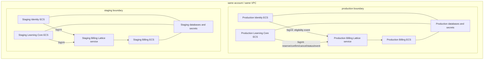

# ADR-002: VPC Lattice·ECS SigV4 서비스 통신과 production/staging 이관

- 상태: 승인된 인프라 계약의 구현 기준; AWS 실제 ID는 배포 전 inventory로 주입
- 작성일: 2026-08-26
- 대상 릴리스: 결제 제외 `FREE_EXAM_ONCE` MVP
- AWS Region: 서울 `ap-northeast-2`
- Jira: 없음
- 관련 기준: `docs/codex/CONTRACT_DECISIONS.md`, `docs/adr/ADR-001-free-trial-internal-api-and-mongo-contract.md`

## 1. 결정 요약

이 ADR은 다음을 확정한다.

- Identity·Learning Core의 Billing 내부 API 호출은 `VPC Lattice + AWS_IAM + ECS application task role + SigV4`를 사용한다.
- production과 staging은 같은 AWS account·VPC를 사용하지만 Lattice service network, ECS application task role, security group, Secret과 database를 분리한다.
- Billing은 ALB를 두지 않고 Lattice service에만 ECS target으로 연결한다. task IP에 직접 접근하는 경로는 security group으로 차단한다.
- Lattice Billing service는 `AWS_IAM` auth type과 명시적 service auth policy를 사용한다. wildcard principal과 환경 간 role 공유를 금지한다.
- Identity role은 trial eligibility event route만, Learning Core role은 reservation·status·AttemptGroup event route만 호출한다.
- Java client는 AWS SDK v2 signer, `DefaultCredentialsProvider`, signing service `vpc-lattice-svcs`, signing region `ap-northeast-2`를 사용한다.
- internal base URL은 환경별 Lattice 기본 DNS를 사용하며 custom domain은 초기 범위에서 제외한다.
- 현재 실제 운영 트래픽을 처리하는 `tosunsaeng-staging-cluster`는 새 production cluster로 이관을 완료한 뒤 최종 staging으로 사용한다.
- Billing production 배포는 새 production의 Identity·Learning Core 이관, 환경 격리와 staging C3-D negative/E2E test 통과 후에만 허용한다.

이 ADR은 AWS resource를 생성·수정·배포하지 않는다. 실제 account ID, VPC/subnet ID, role ARN, SG ID, Lattice service/network/target group ARN과 DNS은 credential이 있는 환경에서 read-only inventory로 확인한다.

## 2. 범위와 비범위

이 ADR의 범위다.

- Billing internal ingress
- Identity·Learning Core outbound SigV4
- Lattice service network/service/listener/target group/VPC association
- ECS role, IAM identity policy·Lattice service auth policy
- Billing target·caller·service-network-association security group
- staging on-demand scale·negative/E2E gate
- 현재 운영 cluster에서 새 production cluster로의 이관 순서

아래는 비범위다.

- Apple/Google 결제, credit/pass/coupon
- public 사용자 Billing API와 사용자 JWT audience
- Identity/Learning Core 도메인 코드의 이 ADR 범위 밖 리팩터링
- Terraform/CDK/CloudFormation 도입 자체
- 실제 AWS 생성·DNS 전환·GitHub Actions 추가
- privileged repair-confirm의 wire DTO; 별도 계약 전에는 repair route를 열지 않음

## 3. 현재 사실과 목표 topology

### 3.1 현재 사실

- Identity와 Learning Core는 `tosunsaeng-staging-cluster`의 ECS Service로 실행 중이다.
- workflow와 health URL은 staging으로 표기되지만 현재는 이 cluster가 실제 운영 트래픽을 처리한다.
- Identity·Learning Core는 ALB를 사용하고 Service Connect는 사용하지 않는다.
- Billing과 VPC Lattice는 아직 배포되지 않았다.
- 최초 ECS/ALB/IAM/SG는 AWS Console에서 수동 생성했다.
- GitHub Actions는 OIDC role을 assume해 ECR image를 push하고, 기존 ECS Service의 Task Definition을 조회·render·register해 image revision을 갱신한다. 최초 인프라를 생성하지는 않는다.

### 3.2 목표 topology



production role은 staging service를, staging role은 production service를 호출할 수 없다. 같은 VPC이므로 DNS·routing만으로 격리했다고 간주하지 않고 IAM auth policy와 SG를 모두 사용한다.

## 4. 환경별 리소스 계약

이름은 논리 기준이며 실제 ID/ARN은 infra output으로 주입한다.

| 리소스 | production | staging |
| --- | --- | --- |
| ECS cluster | `tosunsaeng-production-cluster` 신규 | 기존 `tosunsaeng-staging-cluster` 전환 |
| Lattice service network | `tosunsaeng-production-service-network` | `tosunsaeng-staging-service-network` |
| Billing Lattice service | `tosunsaeng-production-billing` | `tosunsaeng-staging-billing` |
| Billing target group | `tosunsaeng-production-billing-tg` | `tosunsaeng-staging-billing-tg` |
| Billing ECS Service | `tosunsaeng-billing-service` | `tosunsaeng-billing-service` |
| Billing port name | `billing-http` | `billing-http` |
| Billing container port | `8082` | `8082` |
| listener | HTTPS `443` | HTTPS `443` |
| target protocol | HTTP | HTTP |
| health check | `GET /actuator/health` | `GET /actuator/health` |
| auth type | `AWS_IAM` | `AWS_IAM` |
| internal base URL | Lattice generated HTTPS DNS | 별도 Lattice generated HTTPS DNS |

필수 infra output은 다음이다.

```text
awsRegion
awsAccountId
vpcId
privateSubnetIds
serviceNetworkId/serviceNetworkArn
serviceNetworkVpcAssociationId
billingServiceId/billingServiceArn/billingServiceDns
billingTargetGroupArn
ecsInfrastructureRoleArn
identityTaskRoleArn
learningCoreTaskRoleArn
billingTaskRoleArn
taskExecutionRoleArns
serviceNetworkAssociationSecurityGroupId
identityTaskSecurityGroupId
learningCoreTaskSecurityGroupId
billingTargetSecurityGroupId
```

이 값을 application repository에 ARN 문자열로 중복 하드코딩하지 않는다. Task Definition, deployment parameter 또는 보안된 환경 설정이 infra output을 참조한다.

## 5. Lattice·ECS 리소스 구성

### 5.1 service network·VPC association

- production/staging service network를 각각 같은 VPC에 associate한다.
- 각 association에 환경 전용 SG를 연결한다.
- association SG는 해당 환경 Identity·Learning Core task SG에서 오는 TCP 443만 허용한다.
- 반대 환경 task SG, 공인 Internet, ALB SG를 source로 허용하지 않는다.

### 5.2 Billing service·listener·target

- Billing Lattice service의 auth type은 생성 시부터 `AWS_IAM`으로 두며 `NONE`으로 임시 전환하지 않는다.
- HTTPS 443 listener의 default action은 해당 환경 Billing target group으로 forward한다.
- target group은 ECS Fargate/`awsvpc` task IP를 대상으로 하고 HTTP 8082로 전달한다.
- Task Definition port mapping에 `name=billing-http`, `containerPort=8082`, `appProtocol=http`를 명시한다.
- ECS Service의 `vpcLatticeConfigurations`-계열 설정은 해당 target group ARN, `billing-http` port name과 ECS Lattice infrastructure role ARN을 참조한다.
- target deregistration delay, health threshold과 deployment circuit breaker는 운영 기본값을 무조건 복사하지 않고 staging에서 rolling deployment·rollback을 검증한 값으로 고정한다.

### 5.3 health check

- target health check는 `GET /actuator/health`의 HTTP 200만 성공으로 본다.
- health response에 DB URI, hostname, role, Secret 상태 상세를 노출하지 않는다.
- Lattice target health가 정상이기 전에 caller base URL을 전환하지 않는다.
- application readiness와 Mongo transaction readiness를 분리할 필요가 있으면 후속 health group으로 추가하되 민감 세부정보는 노출하지 않는다.

## 6. IAM role 분리

| role | 주체 | 용도 | 금지 |
| --- | --- | --- | --- |
| Identity application task role | Identity task | eligibility event route SigV4 | reservation/repair route, 반대 환경 service |
| Learning Core application task role | Learning Core task | reservation/status/AttemptGroup event SigV4, 기존 S3 최소 권한 | Identity/repair route, 반대 환경 service |
| Billing application task role | Billing task | Billing이 직접 호출하는 AWS API만 | 자신의 invoke, caller role 공유 |
| ECS task execution role | ECS agent | ECR pull, logs, Task Definition Secret/KMS 주입 | application SigV4, 다른 환경 Secret |
| ECS Lattice infrastructure role | ECS service | task target register/deregister에 필요한 Lattice infrastructure 권한 | application API invoke |
| GitHub OIDC deploy role | GitHub Actions | exact ECR/ECS service deploy, 필요 role만 `iam:PassRole` | application runtime credential, wildcard service update |
| operations repair role | 승인된 운영 주체 | 후속 repair endpoint | 일반 ECS task에 attach, 승인 없는 호출 |

추가 계약은 다음과 같다.

- application task role은 Identity/Learning Core/Billing 각각, production/staging 각각 새로 둔다.
- Learning Core의 기존 S3 권한은 새 role에 최소 resource로 이전하고 broad managed policy를 추가하지 않는다.
- application은 ECS container credential endpoint를 직접 호출하지 않고 AWS SDK `DefaultCredentialsProvider`를 사용한다.
- static access key, shared API key, Identity client secret과 workload JWT를 추가하지 않는다.
- ECS infrastructure role은 `ecs.amazonaws.com` trust와 ECS↔Lattice target lifecycle에 필요한 AWS 권장 infrastructure policy만 사용하고 task에 attach하지 않는다.
- GitHub deploy role의 `iam:PassRole`은 해당 환경 task role, execution role, 필요한 infrastructure role ARN으로 제한한다.

Billing MVP에서 Billing application이 다른 AWS data-plane API를 직접 호출하지 않는다면 Billing task role은 trust만 있고 application permission이 없을 수 있다. Mongo URI·Secret 주입은 execution role의 역할이지 Billing task role에 broad Secrets Manager 권한을 주는 근거가 아니다.

## 7. route별 authorization

### 7.1 permission matrix

| method/path | Identity role | Learning Core role | repair role |
| --- | --- | --- | --- |
| `POST /internal/v1/eligibility/trial/events` | allow | deny | deny |
| `POST /internal/v1/reservations` | deny | allow | deny |
| `POST /internal/v1/reservations/*/confirm` | deny | allow | deny |
| `POST /internal/v1/reservations/*/cancel` | deny | allow | deny |
| `POST /internal/v1/reservations/status` | deny | allow | deny |
| `POST /internal/v1/attempt-group-events` | deny | allow | deny |
| future repair route | deny | deny | 별도 DTO/ADR 승인 전 deny |
| `/actuator/health` | Lattice auth API 경로로 사용하지 않음 | 동일 | deny |

모든 미명시 route/method/principal은 implicit deny다. 특히 `GET /internal/**`, wildcard `/internal/*`, 사용자 JWT principal과 GitHub deploy role을 허용하지 않는다.

### 7.2 caller identity policy

각 caller task role은 자신 환경의 Billing service ARN에 대한 invoke만 가진다. 실제 ARN은 infra output으로 치환한다.

```json
{
  "Version": "2012-10-17",
  "Statement": [
    {
      "Sid": "InvokeEnvironmentBillingOnly",
      "Effect": "Allow",
      "Action": "vpc-lattice-svcs:Invoke",
      "Resource": "${billing_service_arn}/*"
    }
  ]
}
```

production role policy에 staging service ARN을, staging role policy에 production service ARN을 넣지 않는다.

### 7.3 Billing service auth policy

Lattice Billing service에 route/method/principal을 동시에 제한하는 resource policy를 attach한다. 아래는 형태 기준이며 deployment pipeline은 generated service ARN과 role ARN을 주입해 정상 JSON으로 만든다.

```json
{
  "Version": "2012-10-17",
  "Statement": [
    {
      "Sid": "IdentityEligibilityEventsOnly",
      "Effect": "Allow",
      "Principal": {
        "AWS": "${identity_task_role_arn}"
      },
      "Action": "vpc-lattice-svcs:Invoke",
      "Resource": "${billing_service_arn}/*",
      "Condition": {
        "StringEquals": {
          "vpc-lattice-svcs:RequestMethod": "POST",
          "vpc-lattice-svcs:RequestPath": "/internal/v1/eligibility/trial/events"
        }
      }
    },
    {
      "Sid": "LearningCoreReservationRootAndEvents",
      "Effect": "Allow",
      "Principal": {
        "AWS": "${learning_core_task_role_arn}"
      },
      "Action": "vpc-lattice-svcs:Invoke",
      "Resource": "${billing_service_arn}/*",
      "Condition": {
        "StringEquals": {
          "vpc-lattice-svcs:RequestMethod": "POST"
        },
        "StringLike": {
          "vpc-lattice-svcs:RequestPath": [
            "/internal/v1/reservations",
            "/internal/v1/reservations/status",
            "/internal/v1/reservations/*/confirm",
            "/internal/v1/reservations/*/cancel",
            "/internal/v1/attempt-group-events"
          ]
        }
      }
    }
  ]
}
```

정책 규칙은 다음과 같다.

- `Principal: "*"`, account root principal, organization-wide principal을 사용하지 않는다.
- service network 수준에 broad allow policy를 두지 않고 Billing service policy를 route 권한의 단일 기준으로 둔다.
- 같은 role의 STS session은 IAM이 role principal로 평가하도록 role ARN을 principal로 사용한다.
- 정책 배포 전 IAM Access Analyzer·policy validation과 staging positive/negative 호출로 action, resource ARN format과 Lattice condition key를 검증한다.
- auth policy 적용 전에 caller base URL을 배포하지 않는다.

## 8. security group·network 경계

### 8.1 Billing target SG

- inbound TCP 8082 source는 서울 region VPC Lattice AWS managed prefix list로 제한한다.
- ALB SG, Identity/Learning Core task SG, VPC CIDR 전체, `0.0.0.0/0`을 source로 허용하지 않는다.
- Fargate task에 public IP를 할당하지 않고 private subnet에 배치한다.
- outbound는 MongoDB/DNS/telemetry 등 실제 필요 대상만 허용하되 Atlas/public endpoint로 NAT egress가 필요하면 현재 방식을 inventory한 뒤 최소화한다.

### 8.2 caller task·association SG

- Identity·Learning Core task SG outbound은 TCP 443 Lattice 경로를 허용한다.
- service-network VPC association SG inbound은 해당 환경 caller task SG만 source로 허용한다.
- 환경 간 SG reference를 추가하지 않는다.
- same-VPC task에서 Billing private IP:8082로 직접 호출한 negative test가 timeout/connection rejection으로 실패해야 한다.

SG만으로 호출자 identity를 판단하지 않고 IAM auth policy를 반드시 함께 사용한다. Lattice prefix list 이름·ID는 region에서 read-only 조회하고 문서에 임의 ID를 적지 않는다.

## 9. Java SigV4 client 계약

### 9.1 dependency·credential

- AWS SDK for Java v2 BOM으로 signer/auth 모듈 버전을 일관되게 관리한다.
- Learning Core는 기존 AWS SDK v2 BOM과 `DefaultCredentialsProvider`를 재사용한다.
- Identity는 같은 계열의 AWS SDK v2 BOM과 signer/auth 모듈을 추가하되 S3, STS client를 불필요하게 추가하지 않는다.
- ECS에서 SDK는 task role의 자동 회전 임시 credential을 사용한다. static key 환경변수를 추가하지 않는다.
- local 개발에서 실제 Lattice를 기본 호출하지 않고 fake adapter/WireMock을 사용한다. 명시적 통합 테스트만 AWS SSO/profile credential을 사용할 수 있다.

### 9.2 signing contract

| 항목 | 값 |
| --- | --- |
| algorithm | SigV4 |
| signing service | `vpc-lattice-svcs` |
| signing region | `ap-northeast-2` |
| scheme | HTTPS only |
| credential provider | `DefaultCredentialsProvider` |
| base URL | 환경별 exact Lattice generated DNS |
| redirect | disabled |
| payload | 실제 전송할 UTF-8 JSON byte의 SHA-256 |
| clock | ECS/Fargate host time; 임의 backdate/clock-skew 보정 금지 |

호출 adapter는 다음 순서를 지킨다.

1. fixed base URL과 ADR-001의 고정 path로 URI를 만든다.
2. JSON을 한 번 byte array로 serialize한다.
3. `Host`, `Content-Type`, `Idempotency-Key` 등 최종 header와 body를 요청에 넣는다.
4. task credential을 provider에서 resolve하고 `vpc-lattice-svcs`/`ap-northeast-2`로 서명한다.
5. signer가 만든 `Authorization`, `X-Amz-Date`, session token·payload hash 관련 header를 포함한 요청을 수정 없이 전송한다.

서명 후 URI, query, body 또는 signed header를 변경하지 않는다. base URL을 request body·user input으로 받지 않고 환경 설정의 exact HTTPS host만 허용해 SSRF와 잘못된 환경 호출을 막는다.

### 9.3 timeout·retry

- connect timeout 초기값은 1초, 요청 전체 timeout은 3초로 둔다.
- HTTP client 내부의 숨은 POST 재시도는 끄고, Identity outbox·Learning Core saga가 같은 event ID/`Idempotency-Key`로 재시도한다.
- 409 processing, 429, 503은 `Retry-After`를 준수한다.
- response timeout·connection reset은 commit 여부 불명이므로 새 key를 만들지 않는다.
- 401/403, signature mismatch, request expired는 일반 자동 재시도 대상이 아니다. credential/role/policy/clock 설정 장애로 경보한다.
- 시계 편차는 application이 마음대로 허용치를 늘리지 않는다. Fargate 호스트 시간을 사용하고 signature-time 오류가 한 번이라도 발생하면 운영 이상으로 분류한다.

## 10. Billing application ingress 보안

Lattice가 SigV4 signature, credential expiry, IAM principal과 auth policy를 검증하는 policy enforcement point다. Billing application은 caller가 직접 생성한 `X-Caller-Service`, `X-Principal` 같은 header를 인증 근거로 사용하지 않는다.

배포 계약은 다음과 같다.

- production/staging profile에서 `/internal/v1/**`는 Lattice-only port/SG/target으로만 노출한다.
- Billing ECS Service에 ALB, public IP, Service Connect·Cloud Map public route를 추가하지 않는다.
- 애플리케이션은 Lattice 배포 profile과 필수 설정이 없으면 internal controller를 fail-closed한다.
- Spring Security에서 사용자 Bearer JWT를 internal workload credential로 인식하지 않는다.
- app 단의 route authorization은 ADR-001 DTO·state validation을 담당하고, AWS principal·method/path authorization은 Lattice policy와 SG가 담당한다.
- Lattice가 생성하는 metadata header를 추가 검증하려면 AWS 공식 문서에서 전달·spoofing 제거 계약을 확인한 후에만 사용한다. 미확인 custom header를 만들지 않는다.
- local/test에서는 production security chain을 우회하는 공용 secret을 두지 않고 test-only principal/filter 대체 구현을 사용한다.

edge 실패는 Lattice 401/403으로 종료되며 Billing 도메인 error envelope로 변환하지 않는다.

## 11. configuration·Secret

애플리케이션 설정은 다음을 사용한다.

```text
AWS_REGION=ap-northeast-2
BILLING_INTERNAL_BASE_URL=https://<environment-specific-lattice-generated-dns>
BILLING_INTERNAL_TRANSPORT=LATTICE_SIGV4
```

- signing service는 코드 상수 `vpc-lattice-svcs`로 두고 임의 환경변수로 변경하지 않는다.
- base URL에 path, query, credential을 넣지 않는다.
- production Task Definition에 staging URL을, staging에 production URL을 주입하면 startup validation에서 실패하도록 env marker·allowlist를 함께 관리한다.
- Mongo URI, Identity candidate HMAC key, JWT signing key, Store credential은 repository, task definition plain environment·log에 적지 않고 환경별 Secret reference로 주입한다.
- production과 staging은 Secret ARN, Mongo database, candidate consumer scope/key와 Identity issuer/signing key를 분리한다.
- production migration 중 기존 사용자 token/JWKS 호환성을 유지해야 하므로 signing key·issuer 변경은 트래픽 이관과 동시에 임의로 하지 않는다. 변경이 필요하면 overlap/rotation 계약을 별도로 확정한다.

## 12. staging 운영·E2E gate

### 12.1 scale runbook

staging Lattice service network/service/listener/target/IAM/SG와 staging DB/Secret은 상시 유지한다. 평소 ECS Service는 `desiredCount=0`으로 낮출 수 있다.

```text
1. staging DB/Secret·dependency readiness 확인
2. Identity desiredCount 0 -> 1+
3. Learning Core desiredCount 0 -> 1+
4. Billing desiredCount 0 -> 1+
5. ECS stability·ALB/Lattice target health wait
6. smoke -> auth negative -> idempotency -> E2E test
7. 실패 artifact/log 보존 여부 판정
8. Billing/Learning Core/Identity desiredCount -> 0
```

테스트 실패 시 즉시 0으로 내려 증거를 잃지 않도록, automation은 로그·task ID·failure category를 식별자 없이 보존한 뒤 stop한다. candidate, userId, request body, SigV4 Authorization은 artifact에 남기지 않는다.

### 12.2 필수 positive/negative test

| test | 기대 |
| --- | --- |
| Identity role + eligibility event | Billing 도달, 204/contract response |
| Identity role + reservation route | Lattice 403 |
| Learning Core role + reservation/status/event | Billing 도달 |
| Learning Core role + eligibility route | Lattice 403 |
| staging role + production Billing DNS | Lattice 403 |
| production role + staging Billing DNS | Lattice 403 |
| unsigned request | Lattice 401/403, Billing controller 미도달 |
| wrong signing region/service | Lattice 401/403 |
| signed body/header를 서명 후 변경 | Lattice 401/403 |
| same-VPC direct task IP:8082 | SG 차단 |
| same key/same payload retry | 같은 Reservation/Session 결과 |
| same key/different payload | 409 `IDEMPOTENCY_KEY_CONFLICT` |
| confirm response loss | status/retry/reconciliation으로 하나의 consumption |
| desiredCount 0 -> 1+ | target healthy 후만 E2E 시작 |

unsigned/wrong-role/direct-path test 중 하나라도 성공하면 production 배포를 차단한다.

## 13. 현재 운영 환경 이관 runbook

현재 cluster를 먼저 staging DB/Secret으로 바꾸면 운영 중단·데이터 오염이 발생한다. 반드시 새 production을 먼저 준비한다.

### Phase 0. inventory·backup·rollback 준비

1. 현 ECS cluster/service/Task Definition, application·execution role, ALB/listener/target group, VPC/subnet/SG, DNS, Secret reference, Mongo/Redis/S3/AI dependency를 read-only inventory한다.
2. Secret 값은 읽거나 문서화하지 않고 ARN/reference·version 구조만 확인한다.
3. 현 production data backup·restore 가능 상태를 확인한다.
4. DNS TTL, ALB routing, mobile client base URL, Identity issuer/JWKS, Learning Core token validation 계약과 rollback owner를 기록한다.
5. 변경 window, success metric, rollback threshold·deadline을 승인한다.

### Phase 1. 새 production 기반 생성

1. `tosunsaeng-production-cluster`, production 전용 application/execution/infrastructure/deploy role과 SG를 만든다.
2. production Identity·Learning Core service, target group·ALB/DNS 경로를 기존 계약과 호환되게 준비한다.
3. 운영 데이터를 복사해 두 개의 진실 공급원을 만들지 않는다. 새 production service는 전환 전·후 동일한 production DB/ledger를 사용하고, 기존 cluster는 전환 완료 후에만 새 staging DB로 바꾼다.
4. 새 production에서 background scheduler/outbox consumer가 production을 중복 처리하지 않도록 pre-traffic profile/leader fencing을 사용한다.

### Phase 2. 병행 검증

1. 새 production target health, application smoke, DB/Redis/S3/AI 연결과 Identity→Learning Core token/JWKS 호환성을 확인한다.
2. 실제 사용자 쓰기를 복제하지 않고 synthetic/read-only smoke를 우선한다.
3. 쓰기 검증이 필요하면 전용 test subject·operation key로 제한하고 후속 정리·audit를 수행한다.
4. 기존 환경으로 롤백할 때 token, session·DB state가 호환되는지 확인한다.

### Phase 3. 트래픽 전환

1. 새 background worker를 활성화하고 기존 worker를 fencing해 single active producer/consumer를 유지한다.
2. 별도 production ALB/DNS를 사용하면 weighted DNS/target 비율을 단계적으로 올린다. 단계적 전환이 불가능하면 짧은 maintenance/cutover window와 즉시 rollback을 준비한다.
3. error rate, latency, login/token, exam creation·grading·result query, DB/Redis connection, queue/outbox lag을 관찰한다.
4. rollback threshold를 넘으면 DNS/ALB weight·worker ownership을 기존 환경으로 되돌린다.
5. 안정화 window가 끝나기 전에 기존 service, role, ALB/target을 삭제하지 않는다.

### Phase 4. 기존 cluster를 staging으로 전환

1. 기존 ECS Service를 0으로 내린 후 production DB/Secret/role 참조를 제거한다.
2. staging 전용 DB, Redis/S3/AI dependency, Secret, Identity issuer/signing key·candidate scope, application task role·SG로 Task Definition을 재구성한다.
3. staging Lattice service network/Billing service/policy를 연결한다.
4. staging Identity·Learning Core·Billing을 1+로 올려 환경 교차 차단·C3-D negative/E2E를 통과한다.
5. staging이 production DB/Secret/Lattice DNS를 참조하지 않음을 자동 검사한 뒤 평소 desired count 0 운영을 적용한다.

### Phase 5. Billing production 배포

1. production Lattice/IAM/SG가 staging에서 검증된 동일 구조임을 diff/checklist로 확인한다.
2. Billing task가 healthy이고 Identity/Learning Core SigV4 positive·negative test가 통과한 뒤 caller base URL을 활성화한다.
3. Identity eligibility event backlog/replay와 Learning Core reservation saga를 단계적으로 활성화한다.
4. unsigned/wrong-role/direct-path 중 하나라도 통과하면 즉시 caller 활성화를 되돌린다.

## 14. GitHub Actions 전환 계약

현 workflow는 main push에서 `tosunsaeng-staging-cluster`를 갱신한다. 환경 분리 후에는 다음이 필요하지만, 이 ADR 작성 작업은 workflow를 변경하지 않는다.

- staging과 production deploy job/workflow의 cluster, service, role, health URL을 명시적으로 분리한다.
- production deploy는 protected GitHub Environment·승인·concurrency 제어를 사용하고 production 전용 OIDC role을 assume한다.
- OIDC trust는 exact repository·branch 또는 GitHub Environment subject로 제한한다.
- production deploy role은 staging ECS service를, staging deploy role은 production service를 update할 수 없다.
- 현 Task Definition download→image render→register→service stability 패턴은 유지하되, task/execution/infrastructure role ARN을 변경할 때 exact `iam:PassRole`과 리뷰를 필수로 한다.
- infrastructure 생성을 계속 Console에서 할 경우에도 생성 결과 ARN/ID, policy JSON digest, SG rule·Task Definition diff를 민감값 없이 변경 기록에 남긴다.

Codex는 이 저장소 규칙에 따라 GitHub Actions 추가·배포·push를 수행하지 않는다.

## 15. 관측·로깅

- Lattice access log와 CloudWatch metric을 production/staging destination으로 분리한다.
- service request count, 4xx/5xx, target health, latency, ECS deployment failure, SigV4 401/403·wrong-route 403을 관측한다.
- 401/403 급증, unhealthy target, direct SG rule drift, eligibility outbox lag, reservation confirm reconciliation lag에 경보한다.
- metric label/log에 userId, candidate, operation/reservation ID, SigV4 Authorization, session token·request body를 넣지 않는다.
- access log에는 body/header를 복제하지 않고 권한을 운영 담당 role로 제한한다.
- correlation은 비식별 low-cardinality trace/correlation ID를 사용하고 candidate/userId를 사용하지 않는다.

## 16. 배포 전 fail-closed checklist

- [ ] 실제 VPC/subnet/SG/role/ALB/DNS/Task Definition inventory 완료
- [ ] production/staging DB·Secret·issuer·candidate scope 분리
- [ ] application task role, execution role, infrastructure role, deploy role 분리
- [ ] Lattice auth type `AWS_IAM`, exact-principal service policy 검증
- [ ] caller identity policy에 자신 환경 Billing ARN만 존재
- [ ] Billing target SG에 Lattice prefix list:8082만 inbound
- [ ] Billing ALB/public IP/Service Connect route 없음
- [ ] unsigned/wrong-role/wrong-env/wrong-route/direct-IP negative test 통과
- [ ] same-key retry·confirm response loss·AttemptGroup event E2E 통과
- [ ] 새 production Identity/Learning Core token·DB·dependency·rollback 검증
- [ ] 기존 cluster production reference 제거 후 staging 격리 자동 검사
- [ ] 최소 권한, 로그 비식별, alarm·runbook 검토

한 항목이라도 미충족이면 Billing production caller를 활성화하지 않는다.

## 17. 실제 AWS 값 inventory

현재 로컬 셸에 AWS credential이 없어 실제 값을 조회하지 못했다. 아래는 정책 미확정이 아니라 배포 전 read-only 확인 항목이다.

- account ID·VPC ID·private subnet ID
- 현 Identity/Learning Core ECS Service·Task Definition family/revision
- 현 application `taskRoleArn`, `executionRoleArn`, GitHub OIDC deploy role ARN
- 현 ALB/listener/target group·task SG·DNS entry
- 현 production DB/Redis/S3/Secret reference 구조; Secret 값 제외
- Lattice 생성 후 service network/service/target group ARN, generated DNS, managed prefix list ID

실제 조회 시 Secret, token, password, MongoDB URI, candidate, 결제 원문을 output·WORKLOG에 남기지 않는다.

## 18. 검토한 대안

### A. 기존 ALB + Identity workload JWT

장점: 새 Lattice data plane이 필요 없고 기존 Spring Security/JWKS 구조를 재사용할 수 있다.

단점: Identity에 client-credentials/workload issuer·scope·rotation을 새로 구현해야 하고 Identity 장애가 Billing 호출 credential 발급으로 전파된다. C3-D 승인으로 미채택했다.

### B. API Gateway + AWS_IAM

장점: 외부·파트너 API, usage plan·gateway 표준화에 적합하다.

단점: 현재 목표는 same-VPC ECS 내부 통신이고 public gateway 운영 범위·비용·routing이 추가된다. 미채택했다.

### C. shared service network

장점: network resource 수가 줄어들어 보일 수 있다.

단점: service-hour 과금은 provisioned service 수와 연결되므로 network 공유가 직접적인 주요 비용 절감을 보장하지 않고 환경 오호출·policy drift 영향은 커진다. 미채택했다.

### D. staging Lattice resource를 테스트마다 삭제·재생성

장점: 사용하지 않는 기간의 service-hour 비용을 줄일 수 있다.

단점: ARN/DNS 변경, IAM propagation, configuration drift·E2E 지연이 생긴다. Lattice 리소스는 유지하고 ECS desired count만 0/1+로 운영하는 방식을 채택했다.

## 19. 구현 순서

1. credential 있는 환경에서 현 AWS read-only inventory와 policy validation
2. 새 production cluster·role·SG·ALB/DNS·data dependency 구성 계획 검토
3. Identity/Learning Core production 병행 배포·트래픽 이관·rollback 검증
4. 기존 cluster를 분리된 staging으로 전환
5. production/staging Lattice service network, Billing service/target/listener, IAM/SG 구성
6. Identity eligibility publisher·Learning Core Billing client에 AWS SDK v2 SigV4 adapter 구현
7. Billing Lattice-only internal security profile·ADR-001 API vertical slice 구현
8. staging positive/negative, concurrency, same-key/reconciliation E2E
9. production Billing deploy·caller 단계적 활성화

각 단계는 이전 단계의 rollback 경로와 fail-closed 검증을 통과한 뒤에만 진행한다.
