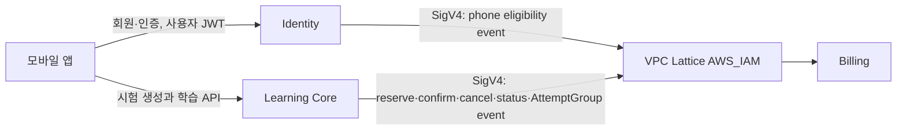
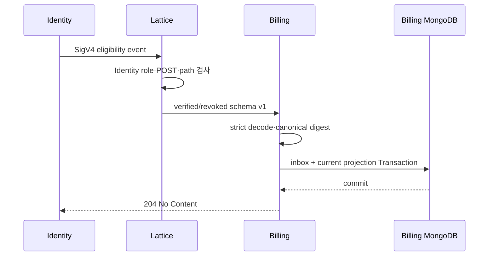
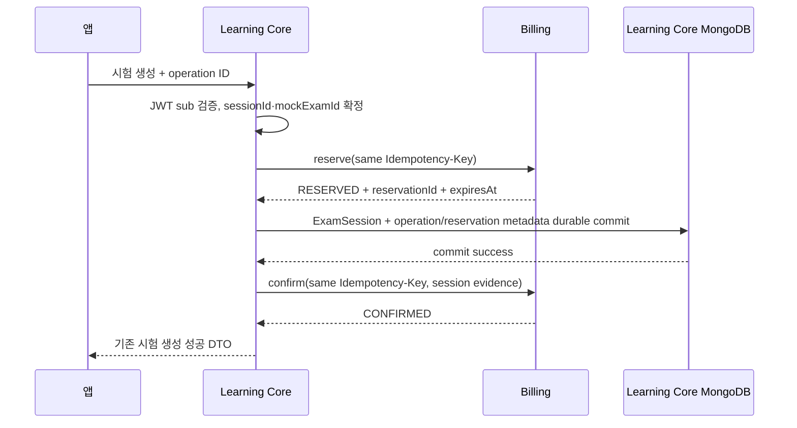

# Billing 서비스 간 연동 계약

- 작성일: 2026-08-27
- 대상 저장소: `app-back-end-billing`
- 상태: 현재 승인된 무료 모의고사 Entitlement 계약의 통합 안내서
- Jira: 없음

## 1. 문서 목적과 기준

이 문서는 앱, Identity, Learning Core와 Billing이 어떤 책임을 가지며 어떤 요청·event를 주고받는지 한곳에서 설명한다.

이 문서는 연동 흐름을 빠르게 파악하기 위한 상위 안내서다. 세부 wire DTO, 상태 전이, MongoDB와 인프라 계약은 다음 문서가 최종 기준이다.

1. 제품 정책: `docs/codex/CONTRACT_DECISIONS.md`
2. 내부 HTTP·DTO·Mongo 계약: `docs/adr/ADR-001-free-trial-internal-api-and-mongo-contract.md`
3. VPC Lattice·SigV4·환경 격리: `docs/adr/ADR-002-vpc-lattice-ecs-sigv4-and-environment-migration.md`
4. 현재 구현 순서: `docs/plans/PLAN-001-trial-eligibility-event-consumer.md`

이 문서와 ADR이 충돌하면 ADR을 따른다. 계약을 변경할 때는 이 안내서만 고치지 않고 producer와 consumer의 ADR·fixture·contract test를 함께 갱신한다.

## 2. 서비스별 책임

| 주체 | 소유하는 것 | Billing 연동 책임 |
| --- | --- | --- |
| 앱 | 사용자 동작과 사용자 Access Token | 시험 시작 operation ID를 생성·보존하고 Learning Core에 같은 값으로 재시도 |
| Identity | 계정, verified phone, 사용자 JWT | phone eligibility state event를 Billing에 전달 |
| Learning Core | 시험 Session, 문제, 제출, 채점, 결과 | 시험 생성 전 reserve, Session commit 후 confirm, 실패 시 cancel, 결과 상태 event 전달 |
| Billing | TrialClaim, entitlement grant·ledger, Reservation, AttemptGroup consumption projection | eligibility와 사용권을 검증하고 hold·consume·release·expiry·reconciliation 수행 |

Billing은 사용자 계정, phone 원문, 시험 문제, 음성, AI 채점 결과를 소유하지 않는다. Identity는 무료권을 지급하지 않고 Learning Core는 entitlement balance를 직접 계산하지 않는다.

## 3. 전체 통신 구조



현재 무료 MVP에는 앱이 Billing을 직접 호출하는 경로가 없다. Billing 사용자 API와 Billing 사용자 JWT audience는 결제 단계까지 보류한다.

Billing도 현재 계약에서는 Identity나 Learning Core를 동기 호출하지 않는다. Identity와 Learning Core가 Billing으로 push하고, Learning Core는 Billing status를 조회해 불명확한 command를 복구한다.

## 4. 공통 전송·인증 계약

### 4.1 운영 통신

- Identity와 Learning Core는 ECS application task role의 임시 credential을 사용한다.
- 요청은 SigV4 service `vpc-lattice-svcs`, region `ap-northeast-2`로 서명한다.
- VPC Lattice Billing service는 `AWS_IAM` auth policy로 principal, HTTP Method와 Path를 함께 검사한다.
- Identity role은 Trial eligibility event route만 호출할 수 있다.
- Learning Core role은 Reservation, status와 AttemptGroup event route만 호출할 수 있다.
- unsigned 요청, 잘못된 role, 반대 환경 role, 권한 없는 route와 Billing task 직접 접근은 거절한다.
- public ALB, shared API key, caller가 임의로 넣은 identity header 또는 사용자 Access Token forwarding을 내부 workload 인증으로 사용하지 않는다.

### 4.2 환경 격리

- production과 staging은 Lattice service network, ECS task role, security group, database와 Secret을 분리한다.
- production role은 staging Billing을, staging role은 production Billing을 호출할 수 없다.
- Billing task는 private subnet에 두고 Lattice managed prefix 경로 외 TCP 8082 직접 접근을 차단한다.
- 실제 role ARN, VPC·subnet·SG·Lattice ID와 DNS는 배포 환경 inventory로 주입하고 저장소에 하드코딩하지 않는다.

### 4.3 HTTP 공통 규칙

- 내부 API prefix는 `/internal/v1`이다.
- `Content-Type`은 `application/json`이다.
- request/response body 상한은 16 KiB다.
- redirect는 허용하지 않는다.
- internal API는 앱용 `BaseResponse`를 사용하지 않는다.
- breaking change는 `/internal/v2`로 올린다.
- v1 optional field는 consumer reader-first 배포 후 producer가 전송한다.
- timeout이나 connection reset은 server commit 여부가 불명확하다는 뜻이므로 새로운 key/event를 만들지 않고 같은 값으로 재시도한다.

### 4.4 식별자 경계

| 값 | 생성·소유 | 전달 규칙 |
| --- | --- | --- |
| `userId` | Identity | lowercase canonical UUID; 인증된 Identity 또는 Learning Core route에서만 수신 |
| `eventId` | event producer | lowercase UUID v4; at-least-once delivery 멱등성 식별자 |
| `operationId` | 앱 | lowercase UUID v4; Billing command에서는 `Idempotency-Key` header가 유일한 source |
| `sessionId` | Learning Core | 기존 `examId`; 1~128자 opaque token |
| `mockExamId` | Learning Core | 1~128자 opaque token; AttemptGroup 동안 고정 |
| `reservationId` | Billing | lowercase UUID v4 |
| `attemptGroupId` | Billing | lowercase UUID v4 |

앱이나 public path가 보낸 `userId`는 신뢰하지 않는다. Learning Core는 사용자 JWT `sub`를 검증한 뒤 그 UUID를 내부 Billing 요청에 전달한다. Identity eligibility event의 `userId`도 인증된 Identity role에서만 신뢰한다.

## 5. Identity → Billing: Trial eligibility 동기화

### 5.1 목적

Identity는 verified phone 원문을 보내지 않는다. Billing이 같은 benefit scope 안에서 무료시험 중복 여부를 판단할 수 있도록 consumer-scoped candidate와 최신 binding 상태만 전달한다.

event 수신은 무료권 지급이 아니다. Billing은 event를 받았다는 이유만으로 TrialClaim, grant, ledger, Reservation 또는 balance를 만들지 않는다.

### 5.2 endpoint와 principal

```http
POST /internal/v1/eligibility/trial/events
```

- 허용 principal: 같은 환경의 Identity ECS task role
- 금지 principal: Learning Core role, 사용자 JWT, deploy role, unsigned caller

### 5.3 event 종류

| eventType | 의미 | candidate 처리 |
| --- | --- | --- |
| `PhoneEligibilityBindingVerified` | 사용자의 verified phone binding 최신 상태 | retained candidate 완전체로 교체 |
| `PhoneEligibilityBindingRevoked` | binding 철회·해제 최신 상태 | candidate 제거, revision tombstone 유지 |

schema v1 공통 필드는 `eventId`, `eventType`, `schemaVersion`, `producer`, `occurredAt`, `consumerScopeId`, `userId`, `bindingRevision`이다. verified event는 `verifiedAt`과 `fingerprintCandidates`, revoked event는 `revokedAt`을 가진다.

Billing은 다음을 strict validation한다.

- exact `schemaVersion=1`, `producer=identity`와 승인된 event type
- 환경 설정의 expected `consumerScopeId` exact match
- lowercase canonical UUID, timestamp와 revision 범위
- verified/revoked 전용 field 상호배타
- candidate 개수, keyVersion, Base64URL value 형식과 중복
- duplicate field, unknown field, trailing token과 scalar coercion 금지

### 5.4 멱등성·순서 처리

Billing은 검증된 event를 canonical JSON으로 정규화하고 SHA-256 digest를 계산한다. raw payload는 저장하지 않는다.

| 조건 | 처리 | HTTP |
| --- | --- | --- |
| 처음 보는 정상 최신 event | inbox APPLIED + current projection 갱신 | 204 |
| 같은 eventId·같은 digest | duplicate no-op | 204 |
| 낮은 bindingRevision | inbox STALE, projection 유지 | 204 |
| revision gap이 있는 더 최신 event | 최신 complete state 적용 + 제한된 metric | 204 |
| 같은 eventId·다른 digest | 기존 기록 유지, conflict | 409 |
| 다른 eventId·같은 scope/user/revision | 기존 기록 유지, conflict | 409 |
| malformed·oversize | 저장하지 않음 | 400 |
| unknown schema/event/producer/scope | 저장하지 않음 | 422 |
| Transaction 일시 장애 | 전체 rollback 또는 commit 재확인 | 503 |

`inbound_event_inbox`와 `trial_eligibility`는 하나의 Mongo Transaction에서 반영한다. Billing은 local commit이 완료됐거나 같은 digest의 기존 commit을 확인한 뒤에만 204를 반환한다.

### 5.5 delivery와 재시도

- Identity delivery는 at-least-once다.
- timeout, 429와 5xx는 같은 eventId와 같은 payload로 재시도한다.
- 429와 503에 유효한 정수 초 `Retry-After`가 있으면 Identity는 자체 backoff보다 이른 시각에 재시도하지 않는다. 비정상·과도한 값의 허용 범위는 Identity 구현 계약에서 제한한다.
- 204는 applied, duplicate 또는 stale을 모두 포함하는 성공 수렴이다.
- eligibility endpoint의 409는 `EVENT_ID_CONFLICT` 전용이다. `COMMAND_PROCESSING`은 Reservation command에만 사용한다.
- 400·409·422는 자동으로 새 eventId를 만들어 우회하지 않고 producer 운영 절차에 따라 격리·조사한다.
- 인증 실패는 payload 문제로 취급하지 않고 role·Lattice policy·환경 설정을 수정한다.



## 6. Learning Core → Billing: 시험 생성 Reservation

### 6.1 앱에서 Billing까지 operation 전달

공개 시험 생성 계약은 다음과 같다.

```http
POST /api/v1/exams
Idempotency-Key: <lowercase UUID v4>
```

Request Body 없음과 기존 성공 Response DTO는 유지하며 `Idempotency-Key` header는 필수다.

1. 앱은 시험 시작 동작마다 UUID v4 `operationId`를 만들고 결과가 확정될 때까지 보존한다.
2. 앱은 Learning Core 시험 생성 요청의 `Idempotency-Key` header로 이 값을 보내며 transport retry에는 같은 값을 사용한다.
3. Learning Core는 사용자 JWT `sub`에서 `userId`를 확정하고 `sessionId`와 `mockExamId`를 준비한다.
4. Learning Core는 같은 operation ID를 Billing `Idempotency-Key`로 사용한다.

Billing은 앱 Access Token을 받거나 검증하지 않는다. Billing이 신뢰하는 caller는 Lattice가 인증한 Learning Core task role이다.

### 6.2 API 목록

| 목적 | Method·Path | 멱등성 |
| --- | --- | --- |
| entitlement hold | `POST /internal/v1/reservations` | `Idempotency-Key=<operationId>` |
| Session commit 후 소비 확정 | `POST /internal/v1/reservations/{reservationId}/confirm` | reserve와 같은 key |
| Session commit 실패 후 hold 해제 | `POST /internal/v1/reservations/{reservationId}/cancel` | reserve와 같은 key |
| operation 상태 확인 | `POST /internal/v1/reservations/status` | read-only; 새 command를 만들지 않음 |

status를 POST body로 조회하는 이유는 `userId`와 operation ID가 URL과 access log에 남는 것을 줄이기 위해서다.

### 6.3 정상 시험 생성 흐름



앱에 성공을 반환하는 시점은 Session commit과 Billing confirm이 모두 확정된 뒤다. 기존 Learning Core 공개 시험 생성 Request Body와 성공 Response DTO는 유지한다.

### 6.4 앱 종료·restart와 transport retry 구분

- 시험 생성 HTTP 응답을 받지 못한 transport retry는 같은 key를 사용해 같은 Session 결과로 수렴한다.
- 사용자가 앱을 종료한 뒤 다시 시험을 시작하는 의도적 restart는 새 `Idempotency-Key`와 새 `examId`를 사용한다.
- 기존 미완료 Session은 `ABANDONED_RESTARTED`로 닫고 새 Session에서 처음부터 시작한다.
- 기존 결과·upload·grading Job·summary를 새 Session에 복사하지 않는다.
- 이전 Session의 늦은 Callback은 새 Session에 저장하지 않고 abandoned fencing에 따라 no-op 처리한다.
- replacement Session은 기존 AttemptGroup consumption을 재사용하고 같은 `mockExamId`를 유지한다.

이 규칙에서 key는 한 번의 Session 생성 command를 식별한다. 무료 replacement entitlement와 transport retry를 같은 의미로 취급하지 않는다.

### 6.5 reserve

reserve는 아직 durable하지 않은 proposed `sessionId`, 고정할 `mockExamId`와 검증된 `userId`를 받는다.

- 새 non-terminal AttemptGroup이 없으면 `INITIAL`이다.
- 최초 INITIAL reserve Transaction에서만 현재 verified binding과 기존 TrialClaim을 확인하고, 필요하면 TrialClaim·free grant를 생성해 1 unit을 hold한다.
- 기존 `OPEN` 또는 `RETAKE_AVAILABLE` group을 이어가는 새 Session이면 `REPLACEMENT`다.
- REPLACEMENT는 기존 consumption을 재사용하고 추가 grant allocation을 만들지 않는다.
- `GRADING` group에는 새 Session을 즉시 허용하지 않고 processing conflict를 반환한다.
- 같은 operation·같은 canonical payload는 기존 Reservation 결과를 반환한다.
- 같은 operation을 다른 payload로 사용하면 409 `IDEMPOTENCY_KEY_CONFLICT`다.

`RESERVED`의 기본 expiry는 5분이다. 이 시간은 사용자 대기시간이 아니라 Session commit 실패 시 hold가 영원히 남지 않게 하는 안전장치다.

### 6.6 confirm

- Learning Core Session이 durable commit된 뒤에만 호출한다.
- stored userId, operation ID와 sessionId가 모두 같아야 한다.
- INITIAL은 allocation을 consume하고 ledger와 AttemptGroup `OPEN`을 만든다.
- REPLACEMENT는 추가 소비 없이 active Session projection만 새 Session으로 연결한다.
- 같은 payload의 재호출은 기존 confirmed 결과를 반환한다.
- CANCELED 또는 EXPIRED Reservation은 일반 confirm으로 복구하지 않는다.
- privileged repair-confirm은 별도 계약과 운영 role 승인 전까지 열지 않는다.

### 6.7 cancel과 expiry

Learning Core Session commit이 실패하면 cancel한다.

- INITIAL cancel은 held allocation을 원 grant로 복원하고 release ledger를 남긴다.
- REPLACEMENT cancel은 기존 consumption을 바꾸지 않는다.
- cancel이나 expiry는 TrialClaim을 삭제하거나 `claimedAt`을 갱신하지 않는다.
- CONFIRMED Reservation은 cancel하거나 expiry시키지 않는다.
- reaper는 `expiresAt`을 지난 `RESERVED`만 명시적으로 `EXPIRED`로 전환한다.
- Reservation·ledger audit document는 Mongo TTL로 삭제하지 않는다.

### 6.8 confirm 응답 유실과 reconciliation

confirm timeout은 성공·실패 중 어느 쪽도 단정하지 않는다.

1. Learning Core는 같은 operation ID로 confirm을 재시도하거나 status를 조회한다.
2. Billing status가 CONFIRMED면 기존 Session을 정상 노출한다.
3. RESERVED면 같은 key로 confirm을 재시도한다.
4. CANCELED·EXPIRED면 자동 repair-confirm하지 않고 reconciliation·운영 정책으로 보낸다.
5. operation을 찾을 수 없으면 Learning Core가 Session과 command 증거를 기준으로 복구 판단한다.

Learning Core는 confirm 결과가 불명확한 Session을 성공으로 먼저 노출하거나 새 operation으로 이중 reserve하지 않는다.

## 7. Learning Core → Billing: AttemptGroup 상태 event

```http
POST /internal/v1/attempt-group-events
```

Learning Core는 시험 문제나 AI 결과 원문을 보내지 않고 Billing consumption 상태에 필요한 최소 증거만 push한다.

| targetStatus | 의미 | 필수 정보 |
| --- | --- | --- |
| `GRADING` | 필수 제출이 접수되고 결과 생성 중 | current active Session fencing |
| `COMPLETED` | 사용자에게 필수 결과가 조회 가능 | feedback·valid score·summary evidence 모두 true |
| `RETAKE_AVAILABLE` | 최종 실패로 같은 consumption 재응시 가능 | 제한된 failureCode; provider 원문 금지 |

- event는 `eventId`와 canonical digest로 멱등 처리한다.
- same eventId·same digest는 204 no-op, 다른 digest는 409다.
- abandoned 또는 stale Session event는 active Session fencing에 실패하면 204 stale no-op다.
- Billing은 Learning Core Session·문제·AI 결과 document를 복제하지 않는다.
- `RETAKE_AVAILABLE.failureCode`는 `REQUIRED_RESULTS_UNAVAILABLE`, `SUMMARY_UNAVAILABLE`, `GRADING_DEADLINE_EXCEEDED`, `RESULT_INTEGRITY_VIOLATION`만 허용한다.
- event revision 없이 group `activeSessionId`, AttemptSession `ACTIVE`, 단방향 transition과 Mongo CAS로 수렴한다. terminal evidence의 역순 도착을 위해 OPEN에서 COMPLETED/RETAKE_AVAILABLE 직접 전진을 허용하되 Learning Core는 Session당 COMPLETED 또는 RETAKE_AVAILABLE terminal event 하나만 Transaction/CAS로 생성한다.
- 정상 순서상 projection 미준비는 503 `ATTEMPT_PROJECTION_NOT_READY`와 `Retry-After: 5`, stale Session은 204, 존재하는 관계 충돌은 409 `EVENT_TARGET_CONFLICT`다.
- Learning Core PENDING outbox는 전달 전 TTL 삭제하지 않고 network/408/425/429/5xx를 5초, 15초, 1분, 5분, 15분 뒤 최대 15분+jitter로 재시도한다. DELIVERED는 30일, DEAD_LETTER는 90일 보존한다.
- W3C `traceparent`를 HTTP header로 전달하고 양쪽 구조화 로그에 `service`, `operation`, `outcome`, `traceId`, `eventId`, `durationMs`를 기록한다. Billing consume은 event 생성부터 수신까지 `eventAgeMs`도 기록한다.
- `service`는 `learning-core`/`billing`, operation과 outcome은 승인된 low-cardinality 값만 사용한다. `durationMs`는 해당 publish/consume 단계의 monotonic elapsed time이고 `eventAgeMs=max(0, consumeNow-occurredAt)`는 outbox 대기·retry를 포함한 전달 지연이다.
- trace context는 JSON/digest/business key가 아니며 baggage, 사용자·Session·AttemptGroup 식별자와 provider 원문은 trace attribute에 넣지 않는다. traceId/eventId/durationMs/eventAgeMs는 metric label로 사용하지 않는다.

## 8. 공통 오류·재시도 규칙

| HTTP | code·종류 | caller 동작 |
| --- | --- | --- |
| 204 | event 처리 성공 | 재시도 종료 |
| 200 | command 최초·replay 성공 | 기존 결과 사용 |
| 400 | `INVALID_REQUEST`, `INVALID_IDEMPOTENCY_KEY` | payload/key 수정; 자동 재시도 금지 |
| 401/403 | Lattice/IAM security response | role·서명·route 설정 수정 |
| 402 | `ENTITLEMENT_INSUFFICIENT` | 무료 entitlement 없음; 자동 재시도 금지 |
| 404 | `OPERATION_NOT_FOUND` | Learning Core reconciliation 판단 |
| 409 | `COMMAND_PROCESSING` | `Retry-After` 후 같은 key 재시도 |
| 409 | `IDEMPOTENCY_KEY_CONFLICT`, `EVENT_ID_CONFLICT` | 자동 우회 금지; 격리·조사 |
| 409 | `EVENT_TARGET_CONFLICT` | 자동 재시도 금지; 관계 충돌 격리·조사 |
| 409 | `RESERVATION_STATE_CONFLICT` | status 조회 후 복구 판단 |
| 422 | `UNSUPPORTED_CONTRACT` | consumer reader 배포·설정 확인 |
| 429 | `RATE_LIMITED` | `Retry-After` 후 같은 event/key 재시도 |
| 503 | `ATTEMPT_PROJECTION_NOT_READY` | `Retry-After: 5` 후 같은 event 재시도 |
| 503 | `BILLING_TEMPORARILY_UNAVAILABLE` | 같은 event/key로 backoff+jitter 재시도 |

processing, 429와 503에는 정수 초 `Retry-After`를 사용한다. retryable 오류에서도 새로운 eventId, operation ID나 Session을 만들지 않는다.

내부 error envelope에는 stable `code`, 안전한 `message`, `retryable`, 비식별 `correlationId`만 둔다. candidate, userId, balance, reservation/payment 식별자, provider 원문, exception과 stack trace를 노출하지 않는다.

## 9. 데이터·개인정보 경계

Billing에 저장하지 않는 값:

- raw phone, last4, 전화번호 암호문
- Firebase UID, provider subject와 Identity phone fingerprint
- HMAC key material
- 사용자 Access Token, SigV4 Authorization와 AWS session token
- 시험 음성, transcript, 문제, AI/provider 결과 원문
- Apple/Google receipt·notification 원문

Billing이 무료 MVP에 저장하는 핵심 값:

- eligibility event inbox와 current binding projection
- benefit-scoped candidate와 keyVersion
- TrialClaim, 삭제 가능한 subject link와 candidate alias
- entitlement grant·allocation·ledger
- Reservation, idempotency command와 AttemptGroup consumption projection

candidate, userId, payload digest와 eventId를 metric tag로 사용하지 않는다. request/response payload 전체를 로그에 남기지 않는다.

## 10. TrialClaim 보존과 owner 변경

- TrialClaim은 최초 `claimedAt`부터 3년 동안 같은 benefit-scoped candidate의 재수급을 막는다.
- 탈퇴·재가입·merge·binding revoke·cancel·Reservation expiry로 `claimedAt`을 갱신하거나 Claim을 다시 열지 않는다.
- 3년 동안 번호가 재할당돼도 기존 Claim을 유지한다.
- `retentionExpiresAt`부터 만료 candidate alias는 dedupe에서 즉시 제외한다.
- daily purge는 logical expiry 후 24시간 안에 candidate, keyVersion, user와 source event 연결을 active DB에서 제거한다.
- backup은 최대 35일이며 복구본을 서비스에 연결하기 전에 현재 시각 기준 expiry purge를 실행한다.
- 3년 뒤 같은 번호가 다시 verified되면 새 Claim을 허용한다.

Identity user merge가 발생해도 Billing은 Claim의 candidate 중복 방지 기록을 삭제하지 않고 entitlement owner mapping만 승인된 owner-transfer Transaction으로 변경한다. 구체적인 `UserMerged` consumer wire 계약은 별도 ADR 확정 전 임의로 추가하지 않는다.

## 11. local·test 계약

- local/test는 실제 AWS credential이나 VPC Lattice를 호출하지 않는다.
- 기본 internal ingress mode는 disabled이며 `/internal/**`를 deny한다.
- contract/MVC test만 명시적인 test workload principal로 endpoint를 활성화한다.
- Repository fake를 사용하는 단위·MVC test와 replica-set Testcontainers 통합 테스트를 분리한다.
- Mongo Transaction·unique index·동시성은 standalone Mongo로 검증했다고 간주하지 않는다.
- Identity와 Learning Core producer fixture를 사용하되 두 서비스의 domain class를 Billing으로 복사하지 않는다.

## 12. 배포와 활성화 순서

1. Billing strict consumer와 local contract test 구현
2. Mongo replica set·명시적 index·Transaction 검증
3. 환경별 Billing Lattice service, auth policy, ECS task role과 SG 준비
4. Billing endpoint를 default deny 상태로 배포
5. Identity caller role·SigV4 client와 eligibility publisher endpoint 설정
6. staging에서 허용 role 성공, unsigned·wrong role·wrong route·direct task 실패 검증
7. eligibility event replay·중복·역순·장애 E2E 검증
8. TrialClaim·grant·Reservation 구현 후 Learning Core SigV4 client와 Session saga 연결
9. same-key retry, Session commit 실패, confirm 응답 유실과 5분 expiry E2E 검증
10. reconciliation·metric·alert와 rollback gate 통과 후 production 활성화

Identity producer나 Learning Core 시험 생성 gate를 Billing consumer보다 먼저 활성화하지 않는다. Billing 장애 시 무료 중복 방지 확인을 우회하는 fail-open도 허용하지 않는다.

## 13. 변경 절차

서비스 간 계약 변경은 다음 순서로 진행한다.

1. 변경 소유 서비스와 영향을 받는 consumer를 식별한다.
2. backward-compatible field 추가인지 breaking change인지 판정한다.
3. ADR과 이 통합 안내서를 갱신한다.
4. consumer decoder와 contract fixture를 reader-first로 배포한다.
5. producer가 새 field/version을 전송한다.
6. 양쪽 contract test와 staging positive/negative E2E를 통과한다.
7. 구 계약 제거가 필요하면 별도 migration·보존 기간 후 제거한다.

다음 변경은 명시적인 공동 승인 없이 수행하지 않는다.

- Identity event type, schemaVersion, field명·타입·의미 변경
- `userId`, `operationId`, `sessionId` 의미 변경
- `Idempotency-Key` source 변경
- route·Method·success/error mapping 변경
- SigV4 service/region, principal과 route authorization 변경
- TrialClaim 보존·재수급 정책 변경
- Learning Core 공개 시험 API Request/Response 변경

## 14. 현재 구현 상태

- Identity의 phone eligibility outbox·publisher는 구현돼 있다.
- Billing은 health-only skeleton이며 Trial eligibility consumer는 아직 구현 전이다.
- Learning Core는 현재 Billing reserve 없이 ExamSession을 생성하므로 Billing saga client가 아직 없다.
- VPC Lattice, Billing ECS service와 실제 IAM/SG 리소스는 아직 없다.
- 현재 첫 구현 작업은 PLAN-001 Trial eligibility event consumer다.
- TrialClaim·grant·Reservation과 Learning Core saga는 PLAN-001 완료 후 후속 vertical slice다.
- Apple/Google 결제, paid credit, pass, coupon과 환불은 무료 MVP 후속이다.

## 15. 연동 점검 체크리스트

Identity 연동:

- Identity role만 Trial route를 호출할 수 있는가
- expected `consumerScopeId`가 환경별로 일치하는가
- same event replay가 204 no-op인가
- stale/revision gap/conflict가 계약대로 수렴하는가
- raw phone과 payload 원문이 전달·로그·저장되지 않는가

Learning Core 연동:

- JWT `sub`에서 확정한 userId만 내부 요청에 보내는가
- 앱 재시도부터 Billing까지 같은 operation ID를 유지하는가
- Session commit 전에 reserve, commit 뒤 confirm 순서를 지키는가
- commit 실패 시 cancel하고 confirm 불명 시 status/retry로 수렴하는가
- Billing confirm 전 앱에 시험 생성 성공을 반환하지 않는가
- REPLACEMENT가 추가 차감 없이 같은 AttemptGroup·mockExamId를 유지하는가

보안·운영:

- production/staging role과 Lattice service가 분리됐는가
- unsigned·wrong role·wrong route·direct task 접근이 실패하는가
- retry가 새 eventId·operation ID·Session을 만들지 않는가
- metric·log·error에 candidate, userId, credential과 payload 원문이 없는가
- Billing 미확인 상태를 fail-open으로 우회하지 않는가
