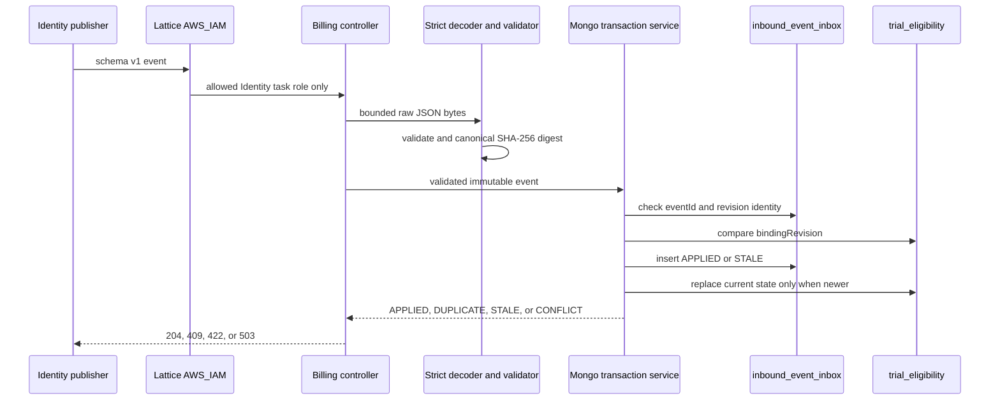

# PLAN-001: Trial eligibility event consumer vertical slice

- 상태: 구현 완료; 실제 AWS Lattice 배포·staging E2E는 승인된 비범위로 유지
- 작성일: 2026-08-26
- 대상 저장소: `app-back-end-billing`
- Jira: `TMI-110`
- 관련 계약: `docs/adr/ADR-001-free-trial-internal-api-and-mongo-contract.md`, `docs/adr/ADR-002-vpc-lattice-ecs-sigv4-and-environment-migration.md`

## 1. 목표

Identity가 at-least-once로 전달하는 `PhoneEligibilityBindingVerified`/`PhoneEligibilityBindingRevoked` schema v1 event를 Billing이 안전하게 수신하고, 한 MongoDB Transaction에서 event inbox 멱등성과 `(consumerScopeId, userId)` current binding high-water를 함께 반영한다.

이 vertical slice가 완료되면 Billing은 다음을 보장한다.

- 같은 `eventId`·같은 payload 재전송은 204 no-op으로 수렴한다.
- 같은 `eventId`·다른 payload는 기존 기록을 덮어쓰지 않고 409 `EVENT_ID_CONFLICT`로 거절한다.
- 다른 `eventId`가 같은 user·scope·revision을 주장하면 409 conflict로 거절한다.
- 낮은 revision이 늦게 도착해도 current binding을 과거로 되돌리지 않는다.
- verified event는 retained candidate 전체를 교체하고 revoked event는 candidate를 제거하되 revision tombstone은 유지한다.
- inbox insert와 binding update 중 하나만 저장되는 부분 성공을 만들지 않는다.
- event 수신은 사용권 지급이 아니며 `TrialClaim`, grant, ledger, Reservation을 만들지 않는다.

## 2. 범위

### 2.1 포함

- `POST /internal/v1/eligibility/trial/events`
- schema v1 strict decode·validation·canonical payload digest
- `inbound_event_inbox` Mongo document/repository/index
- `trial_eligibility` current projection/repository/index
- eventId duplicate·payload conflict·revision stale/gap/conflict 판정
- inbox·binding의 replica-set Mongo Transaction
- stable error envelope·204/400/409/422/503 mapping
- internal endpoint default deny·test/Lattice deployment mode 분리
- privacy-safe metric/logging
- unit, MVC/security, replica-set Testcontainers integration·concurrency test

### 2.2 제외

- TrialClaim, candidate alias, subject link
- free grant·ledger·Reservation·AttemptGroup
- Identity의 publisher·outbox 코드 변경
- Identity/Binding candidate HMAC 생성 또는 key material 저장
- AWS SDK v2 SigV4 client·Lattice/IAM/SG 실배포
- production/staging cluster 이관
- rejected payload 원문 quarantine·dead-letter 저장
- TrialClaim 3년 purge·35일 backup runbook

## 3. 현재 baseline

Billing은 현재 health-only skeleton이다.

- Java 21, Spring Boot 3.4.2, MongoDB, Validation, Security, Actuator
- `/actuator/health`만 permit, 나머지는 deny-all
- MongoDB entity/repository/transaction manager/index initializer가 없음
- test Mongo URI는 standalone localhost로, Transaction/concurrency 검증에 부족함
- `spring.data.mongodb.auto-index-creation=true`로 ADR-001의 explicit migration/fail-fast 원칙과 아직 맞지 않음

Identity producer의 실제 코드는 다음을 강제한다.

| 항목 | schema v1 제약 |
| --- | --- |
| `eventId`, `userId` | lowercase canonical UUID |
| `eventType` | `PhoneEligibilityBindingVerified` 또는 `PhoneEligibilityBindingRevoked` |
| `schemaVersion` | `1` |
| `producer` | `identity` |
| `consumerScopeId` | `[A-Za-z0-9._:-]{1,128}` |
| `bindingRevision` | `1..9,007,199,254,740,991` |
| candidates | verified는 1~8개, revoked는 field 없음 |
| `keyVersion` | `[A-Za-z0-9._-]{1,32}`, 배열 내 unique |
| candidate `value` | Base64URL padding 없는 43자 |
| event time | verified/revoked time은 `occurredAt` 이후일 수 없음 |
| body | 16 KiB 이하 |

Billing은 이 형식을 다시 해석해 느슨하게 받지 않고 producer fixture와 contract test로 고정한다.

## 4. Phase 0: ADR-001 기술 보정 — 문서 반영 완료

ADR-001은 same user·scope·revision/different event를 conflict로 규정했지만 기존 `inbound_event_inbox` field/index 표에는 `consumerScopeId`와 revision unique index가 빠져 있었다. 2026-08-27 문서 보정으로 다음 계약을 ADR-001에 반영했다.

- inbox field에 `consumerScopeId` 추가
- unique index 추가:

```text
{producer: 1, consumerScopeId: 1, userId: 1, bindingRevision: 1}
unique, Identity revision event에만 적용하는 partial filter
name: ux_inbox_identity_scope_user_revision
```

이는 새 제품 정책이 아니라 기존 409 계약을 race condition에서도 보장하는 저장 구조 보정이다. 구현 Step 1에서는 producer fixture와 함께 ADR-001·PLAN의 field/index/disposition이 실제 document와 initializer에 일치하는지 검증한다.

## 5. 목표 처리 흐름



Lattice 미배포 local/test에서는 test-only workload principal이 edge를 대체한다. default/runtime 설정이 없으면 controller는 계속 deny-all이다.

## 6. package·파일 계획

기존 Billing에 도메인 package 관행이 아직 없으므로 이 vertical slice를 기준 구조로 삼는다.

```text
src/main/java/web/tosunsaeng/billing/
  config/
    MongoTransactionConfig.java
    InternalIngressProperties.java
    SecurityConfig.java                         # modify
  global/api/
    InternalApiError.java
    InternalApiExceptionHandler.java
  global/mongodb/
    BillingMongoIndexInitializer.java
    MongoTransactionExecutor.java
  trialeligibility/api/
    TrialEligibilityEventController.java
    TrialEligibilityEventDecoder.java
    TrialEligibilityRequestSizeFilter.java
  trialeligibility/application/
    TrialEligibilityEventService.java
    TrialEligibilityEventOutcome.java
  trialeligibility/domain/
    TrialEligibilityEvent.java
    TrialEligibilityEventType.java
    TrialEligibilityCandidate.java
    TrialEligibility.java
    InboundEventInbox.java
  trialeligibility/infrastructure/
    InboundEventInboxRepository.java
    TrialEligibilityRepository.java

src/test/java/web/tosunsaeng/billing/
  trialeligibility/api/
    TrialEligibilityEventDecoderTest.java
    TrialEligibilityEventControllerTest.java
  trialeligibility/application/
    TrialEligibilityEventServiceTest.java
  trialeligibility/infrastructure/
    TrialEligibilityMongoIntegrationTest.java
    TrialEligibilityConcurrencyIntegrationTest.java
  config/
    InternalIngressSecurityTest.java

src/test/resources/contracts/identity/
  trial-eligibility-verified-v1.json
  trial-eligibility-revoked-v1.json
```

클래스를 잘게 나누되 DTO, entity, repository, service를 다른 서비스에서 복사하지 않는다. Identity에서는 wire fixture·field constraint만 참조한다.

## 7. API·decode 계획

### 7.1 controller

- endpoint: `POST /internal/v1/eligibility/trial/events`
- consumes: `application/json`
- success: body 없는 `204 No Content`
- body를 무제한 DTO로 받지 않고 16 KiB bounded byte로 받아 strict decoder에 전달한다.
- `Content-Length` 초과는 먼저 거절하고 chunked/length 미지정 요청도 bounded stream으로 재검증한다.
- request/response body, candidate, userId, Authorization을 controller log에 남기지 않는다.

### 7.2 strict decoder

전용 Jackson decoder는 다음을 강제한다.

- duplicate JSON field 거절
- trailing token 거절
- string/number/boolean coercion 금지
- schema v1에 알려지지 않은 field 거절; optional field 추가는 reader-first 배포로 decoder를 먼저 확장
- exact eventType·schemaVersion·producer·scope 확인
- verified/revoked 전용 field 상호배타
- UUID·revision·candidate count/format/unique validation
- event time parse·순서 validation

`consumerScopeId`는 형식만 맞는 임의 값을 받지 않고 Billing 환경 설정의 expected opaque scope와 exact match해야 한다. expected scope와 다른 정상 형식의 event는 422 `UNSUPPORTED_CONTRACT`로 거절하고 저장하지 않는다.

### 7.3 canonical digest

SHA-256 digest는 raw whitespace/property order가 아니라 검증된 event의 canonical JSON byte에 대해 계산한다.

- common field는 Identity `@JsonPropertyOrder` 순서
- verified candidates는 `keyVersion`, `value` 순서로 sort
- revoked에는 candidate/verified field 없음
- timestamp는 UTC Instant canonical text로 정규화
- UUID는 lowercase canonical text
- digest는 lowercase hex 또는 고정 형식으로 저장하되 소스 payload를 저장하지 않음

같은 의미의 candidate 배열 순서·JSON property order·whitespace 차이는 같은 digest로 수렴하고 검증된 field 값의 차이는 다른 digest가 된다.

## 8. MongoDB document·index 계획

### 8.1 `inbound_event_inbox`

```text
eventId
producer
eventType
schemaVersion
payloadDigest
consumerScopeId
userId
bindingRevision
disposition = APPLIED | STALE
receivedAt
purgeAt = receivedAt + 120 days
```

`DUPLICATE`는 새 문서를 만들지 않고 기존 inbox를 읽어 반환하는 처리 outcome이다. conflict도 기존 문서를 수정하지 않고 metric/alert만 남긴다. malformed/unsupported payload 원문은 inbox에 저장하지 않는다.

| index | key/option |
| --- | --- |
| `ux_inbox_event_id` | `{eventId: 1}`, unique |
| `ux_inbox_identity_scope_user_revision` | `{producer: 1, consumerScopeId: 1, userId: 1, bindingRevision: 1}`, unique partial for Identity revision events |
| `ttl_inbox_purge_at` | `{purgeAt: 1}`, `expireAfterSeconds: 0` |

### 8.2 `trial_eligibility`

```text
consumerScopeId
userId
bindingRevision
state = VERIFIED | REVOKED
candidates[{keyVersion, value}]
verifiedAt?
revokedAt?
lastEventId
lastPayloadDigest
updatedAt
version
```

- verified는 candidates 완전체를 replace한다. patch/append하지 않는다.
- revoked는 candidates와 verifiedAt을 제거하고 revokedAt·revision tombstone을 남긴다.
- candidate value가 들어간 `toString`, exception, audit event를 만들지 않는다.
- revoked high-water cleanup은 보존 계약 없이 이 vertical slice에서 임의로 추가하지 않는다.

| index | key/option |
| --- | --- |
| `ux_trial_scope_user` | `{consumerScopeId: 1, userId: 1}`, unique |
| `ix_trial_key_version` | `{consumerScopeId: 1, "candidates.keyVersion": 1}`, non-unique |

### 8.3 index initializer

- annotation/`auto-index-creation`에 운영 정합성을 의존하지 않는다.
- `spring.data.mongodb.auto-index-creation=false`로 변경한다.
- versioned initializer가 key order, unique, partial filter, TTL option과 index name을 비교한다.
- 없는 index는 승인된 initializer/migration mode에서 생성하고, 같은 이름의 option이 다르면 startup fail-fast한다.
- index를 임의 drop/recreate하지 않고 production 변경은 별도 deployment step으로 승인한다.

## 9. Transaction·동시성 알고리즘

validation/digest는 Transaction 밖에서 수행하고, 아래 DB 처리는 replica-set Mongo Transaction 하나에서 수행한다.

```text
1. eventId inbox 조회
   - same digest: DUPLICATE -> 204
   - different digest: EVENT_ID_CONFLICT -> 409
2. same producer/scope/user/revision inbox 조회
   - different eventId: EVENT_ID_CONFLICT -> 409
3. current binding 조회
4. incoming revision < current revision
   - inbox STALE insert
   - binding unchanged
5. incoming revision > current revision 또는 binding 없음
   - inbox APPLIED insert
   - verified/revoked current binding replace/upsert
6. Transaction commit 후에만 204
```

revision gap은 fail-open 자격 지급이 아니라 최신 revoke/verified state를 지키는 high-water 문제다. `incoming > current + 1` 또는 첫 event revision이 1보다 큰 경우도 최신 state를 적용하되 low-cardinality `revision_gap` metric/alert를 남기고 사용권은 지급하지 않는다.

동시 insert race에서 unique violation이 발생하면 Transaction을 abort하고 신규 Transaction/읽기로 기존 eventId·revision inbox를 재판정해 duplicate 또는 conflict로 수렴한다. duplicate key를 무조건 500으로 반환하지 않는다.

### 9.1 Transaction retry

- `TransientTransactionError`: bounded retry
- `UnknownTransactionCommitResult`: eventId inbox를 재조회해 same digest commit이 확인되면 204, conflict면 409, 없으면 같은 event로 bounded retry
- retry는 검증된 immutable event/digest를 재사용
- retry 한도 초과: 503 `BILLING_TEMPORARILY_UNAVAILABLE` + `Retry-After`
- catch-all infinite retry·새 eventId 생성 금지

MongoDB replica set이 아니거나 Transaction capability를 확인할 수 없는 production/staging profile은 startup fail-closed한다. local unit/MVC test는 repository fake를 사용하고 DB integration test는 Testcontainers replica set을 사용한다.

## 10. HTTP·error mapping

| 상황 | HTTP/code | DB 변경 |
| --- | --- | --- |
| 처음 적용 | 204 | inbox APPLIED + binding update |
| same eventId/same digest | 204 | 없음 |
| stale lower revision | 204 | inbox STALE only |
| same eventId/different digest | 409 `EVENT_ID_CONFLICT` | 없음 |
| same scope/user/revision/different event | 409 `EVENT_ID_CONFLICT` | 없음 |
| malformed/oversize/duplicate JSON field | 400 `INVALID_REQUEST` | 없음 |
| unknown event/schema/producer/scope | 422 `UNSUPPORTED_CONTRACT` | 없음 |
| Mongo transient/exhausted retry | 503 `BILLING_TEMPORARILY_UNAVAILABLE` | atomic rollback 또는 commit recheck |
| unsigned/wrong role | Lattice 401/403 | controller 미도달 |

error envelope에 event payload, candidate, userId, binding revision, Mongo exception/stack trace를 넣지 않는다. correlation ID는 서버가 생성한 비식별 값을 사용한다.

## 11. Security 계획

현 `SecurityConfig` deny-all을 그냥 풀지 않는다.

- default `billing.internal-ingress.mode=disabled`: `/internal/**` deny
- deployment `lattice-aws-iam` mode: ADR-002의 ALB 없는 Lattice-only target/SG 경계와 필수 설정을 startup에 검증한 뒤 endpoint 활성화
- test mode: test source set의 명시적 workload principal만 사용
- Bearer user JWT, caller-provided `X-Caller-Service`, shared secret header를 Identity workload 인증으로 사용하지 않음
- default profile security test는 endpoint 403을 계속 보장
- Lattice 미배포 상태에서 production endpoint를 녹색으로 열지 않음

이 vertical slice의 local security 대체 구현은 운영 credential이 아니며 application main source에 static API key를 추가하지 않는다.

## 12. Privacy·observability

### 12.1 금지

- raw phone, last4, Firebase UID, Identity fingerprint/HMAC key material 수신·저장
- candidate/userId/payload digest/eventId를 metric tag로 사용
- request/response body, candidate array, Authorization·AWS session token log
- validation exception에 offending value 포함
- entity/record generated `toString()`으로 candidate 노출

### 12.2 metric

```text
billing.trial_eligibility.events{
  eventType=VERIFIED|REVOKED|UNKNOWN,
  schemaVersion=1|OTHER,
  outcome=APPLIED|DUPLICATE|STALE|CONFLICT|INVALID|UNSUPPORTED|TEMPORARY_FAILURE
}
```

revision gap, event conflict, Transaction retry exhausted는 별도 counter/alarm 대상이다. `consumerScopeId`, userId, candidate, revision 숫자를 label에 넣지 않는다.

log는 server correlation ID, eventType/schemaVersion, outcome, low-cardinality failure category만 남긴다. eventId도 일반 application log에 남기지 않고 필요한 멱등 조사는 접근 제한된 DB/trace 절차로 한다.

## 13. 테스트 계획

### 13.1 decoder·domain unit test

- Identity 실제 mapper와 동일한 verified/revoked fixture 수신
- verified 1개/8개 candidate 경계값
- 0개/9개, duplicate keyVersion, invalid Base64URL/value length 거절
- revoked의 candidate/verifiedAt, verified의 revokedAt 거절
- unknown field/event/schema/producer/scope 거절
- non-canonical UUID, revision 0/max 초과, invalid time order 거절
- duplicate JSON field, trailing token, scalar coercion, 16 KiB 초과 거절
- candidate/property order·whitespace 차이는 같은 digest
- 의미 변경은 다른 digest
- candidate/domain event `toString()` redaction

### 13.2 application service unit test

- no current binding + verified/revoked apply
- current revision보다 높은 verified/revoked replace
- stale revision inbox only
- duplicate same digest no-op
- same eventId/different digest conflict
- same user/scope/revision/different event conflict
- revision gap apply + safe metric
- repository exception과 retry exhaustion mapping

### 13.3 MVC·security test

- correct content type/fixture 204
- invalid/unsupported/conflict/temporary failure error envelope
- response/body/header에 sensitive value 없음
- default mode endpoint 403
- test principal의 Identity route success
- Learning Core/wrong test principal 403
- health endpoint은 계속 200, 미설정 endpoint deny-all

### 13.4 replica-set Testcontainers integration test

- Mongo image는 `latest`가 아닌 production 호환 pinned version; 실제 production version inventory 후 확정
- `MongoTransactionManager` 실제 Transaction commit/rollback
- inbox APPLIED·binding update atomicity
- stale inbox + binding unchanged atomicity
- required index key/order/unique/partial/TTL option 일치
- initializer re-run idempotency과 option mismatch fail-fast
- same event 2개 concurrency -> one inbox, both 204
- same eventId/different payload concurrency -> one commit, one 409
- different eventId/same scope/user/revision concurrency -> one commit, one 409
- revision 1/2 reverse arrival -> final revision 2
- verified/revoked race -> highest revision state
- duplicate-key abort 후 재판정이 500이 아닌 duplicate/conflict로 수렴
- simulated transaction failure에서 partial document 없음

### 13.5 전체 검증

```bash
./gradlew clean test
```

Docker/Testcontainers가 불가능한 환경에서 integration test를 무조건 skip해 성공처리하지 않는다. CI/merge gate에서 replica-set 테스트가 실제 성공해야 한다.

## 14. 구현 단계

### Step 1. contract fixture·ADR 계약 구현

- Identity producer wire fixture 2개를 fake 값으로 추가
- producer constraint를 Billing decoder test로 고정
- ADR-001 inbox `consumerScopeId`·revision unique index·APPLIED/STALE disposition 구현

### Step 2. domain·decoder

- immutable event/candidate/type/outcome 구현
- strict bounded JSON decode·validation·canonical digest
- sensitive `toString` redaction test

### Step 3. Mongo foundation

- transaction manager·capability verifier
- inbox/current binding document·repository
- explicit versioned index initializer
- auto-index disabled

### Step 4. application Transaction

- eventId/revision 판정
- APPLIED/STALE insert·binding replace
- unique race convergence·bounded transaction retry
- metric

### Step 5. controller·error·security

- internal endpoint·size filter
- stable error mapping
- default disabled/test/Lattice deployment mode 분리
- current health/deny-all regression test 유지

### Step 6. integration·concurrency validation

- replica-set Testcontainers
- atomicity/index/concurrency/reverse-order test
- `./gradlew clean test`
- privacy/log review·documentation update

각 Step은 독립적으로 검토 가능하게 유지하되 부분 계약을 production에 배포하지 않는다.

## 15. 완료 조건

- [x] ADR-001 inbox field/index 보정이 문서와 코드에 일치
- [x] verified/revoked producer fixture contract test 성공
- [x] 16 KiB·strict JSON·schema/field/candidate validation 성공
- [x] eventId duplicate·digest conflict·same revision conflict 계약 성공
- [x] stale event가 current binding을 되돌리지 않음
- [x] verified replace·revoked clear/high-water 보존
- [x] inbox/binding Transaction atomicity·unknown result recheck 성공
- [x] index option·concurrency Testcontainers 성공
- [x] default endpoint deny·wrong principal deny·test Identity principal success
- [x] candidate/userId/payload/credential 로그·metric 노출 없음
- [x] TrialClaim/grant/ledger/Reservation 생성 없음
- [x] `./gradlew clean test` 성공
- [x] `CURRENT_STATE.md`·`WORKLOG.md` 갱신

## 16. 위험·대응

| 위험 | 대응 |
| --- | --- |
| Identity 실제 JSON과 Billing DTO drift | producer fixture·strict contract test, reader-first schema 확장 |
| eventId/revision race로 partial overwrite | 두 unique index + local Transaction + duplicate re-read |
| standalone Mongo에서 Transaction이 거짓 성공 | replica-set capability fail-fast + Testcontainers |
| candidate가 generated `toString`/validation log에 노출 | 명시적 redacted type, offending value 없는 exception, log test/review |
| unknown commit result로 Identity가 계속 retry | eventId inbox commit recheck, same-event bounded retry |
| revision gap을 이전 state로 rollback | greater revision apply + gap metric; TrialClaim 미지급 |
| Lattice 없이 endpoint를 조기 공개 | default disabled/deny-all, test-only principal, deployment gate |
| auto index가 production index option을 임의 변경 | auto-index off, versioned initializer compare/fail-fast |
| malformed payload DB abuse | pre-Transaction size/decode/contract rejection, rejected raw payload 미저장 |

## 17. 후속 작업

이 vertical slice 완료 후 다음 작업은 current verified binding을 읽어 첫 reserve Transaction에서 다음을 함께 만드는 것이다.

1. `TrialClaim`
2. `trial_candidate_aliases`
3. `billing_subject_links`
4. `FREE_EXAM_ONCE` grant·`GRANTED` ledger
5. INITIAL Reservation·allocation hold

후속 reserve는 본 계획의 current binding·revision high-water를 신뢰하므로, 본 vertical slice의 Transaction·concurrency·privacy 완료 조건을 우회해 먼저 구현하지 않는다.

## 18. 구현 결과

2026-08-27 Jira `TMI-110` 범위로 구현을 완료했다.

- strict duplicate detection, trailing token·scalar coercion·unknown field 거절과 exact producer/schema/scope 검증을 구현했다.
- 검증된 값을 Identity property order와 candidate sort로 canonicalize한 뒤 SHA-256 digest를 저장하며 raw payload는 저장하지 않는다.
- `inbound_event_inbox`와 `trial_eligibility` document, 단일 Mongo Transaction, bounded retry와 commit 결과 재확인, duplicate-key race 수렴을 구현했다.
- 승인된 5개 index를 명시적으로 생성·option 비교하고 불일치 시 drop/recreate 없이 fail-fast한다. Mongo replica-set capability도 ingress 활성화 환경에서 fail-closed한다.
- 기본 disabled, test Identity role, Lattice-only deployment mode를 분리하고 16 KiB bounded endpoint와 안정적인 204/400/409/422/503 계약을 구현했다.
- `mongo:7.0.14` replica-set Testcontainers를 포함한 33개 테스트로 strict decode, digest, security, transaction rollback, index option, stale/high-water와 동시 duplicate/conflict를 검증했다.
- `./gradlew clean test`가 성공했다. 실제 Lattice/IAM/SG 생성, Identity SigV4 adapter와 staging E2E는 PLAN-001/Jira `TMI-110`의 승인된 제외 범위이며 완료로 주장하지 않는다.
