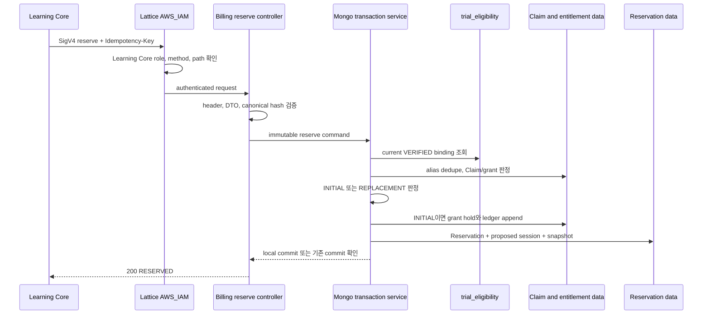

# PLAN-002: Free exam initial reserve vertical slice

- 상태: 구현 완료; production 활성화 gate 유지
- 작성일: 2026-08-28
- 대상 저장소: `app-back-end-billing`
- Jira: `TMI-112` — `[Billing] Free exam initial reserve 구현` (`완료`)
- 선행 작업: `PLAN-001` 구현 완료, `TMI-110` 완료
- 관련 계약: `docs/adr/ADR-001-free-trial-internal-api-and-mongo-contract.md`, `docs/adr/ADR-002-vpc-lattice-ecs-sigv4-and-environment-migration.md`, `docs/contracts/BILLING_SERVICE_INTEGRATION_CONTRACT.md`, `docs/codex/CONTRACT_DECISIONS.md`

## 1. 목표

Learning Core가 시험 Session을 만들기 전에 호출하는 `POST /internal/v1/reservations`를 구현한다. Billing은 현재 VERIFIED phone eligibility와 과거 Claim을 확인하고, 필요한 `TrialClaim`, subject link, candidate alias, `FREE_EXAM_ONCE` grant·ledger, allocation hold, Reservation과 proposed Session projection을 하나의 MongoDB Transaction으로 반영한다.

이 vertical slice가 완료되면 Billing은 다음을 보장한다.

- eligibility event 수신만으로는 무료권을 만들지 않고 최초 reserve 시점에만 만든다.
- 같은 verified-phone candidate는 보존기간 안에 `FREE_EXAM_ONCE` Claim 하나로 수렴한다.
- 동일 operation·동일 payload 재시도는 같은 Reservation 응답으로 수렴한다.
- 동일 operation을 다른 payload에 재사용하면 기존 결과를 변경하지 않고 거절한다.
- `INITIAL` reserve는 무료 unit 1개를 5분 동안 hold한다.
- 기존 `OPEN` 또는 `RETAKE_AVAILABLE` AttemptGroup의 재시작은 `REPLACEMENT`로 판정하고 추가 차감하지 않는다.
- concurrent reserve에서도 Claim, grant, active Reservation, active creation command와 proposed Session이 중복 생성되지 않는다.
- 실패하거나 commit 결과가 불명인 경우에도 부분 Claim·grant·Reservation 상태를 남기지 않는다.

## 2. 범위

### 2.1 포함

- `POST /internal/v1/reservations`
- 필수 lowercase UUID v4 `Idempotency-Key` 검증
- reserve request DTO strict validation과 canonical payload hash
- `trial_eligibility` VERIFIED current projection 조회
- 만료 candidate alias fencing과 active alias 교집합 판정
- 필요한 `TrialClaim`, `trial_candidate_aliases`, `billing_subject_links` 생성
- 필요한 `FREE_EXAM_ONCE` grant와 append-only `GRANTED` ledger 생성
- INITIAL allocation hold, grant 수량 전이와 `RESERVED` ledger 생성
- `RESERVED` Reservation, preallocated AttemptGroup ID와 proposed attempt-session projection 생성
- existing AttemptGroup 기반 INITIAL·REPLACEMENT·GRADING 판정
- idempotency command, response snapshot과 duplicate-key 수렴
- 승인된 Mongo index의 versioned initializer 확장
- 단일 replica-set Mongo Transaction, transient retry와 unknown commit 결과 재확인
- stable 200/400/402/409/503 계약
- Learning Core test principal route 허용과 Identity/wrong principal 차단
- privacy-safe log·metric과 unit/MVC/Testcontainers 동시성 검증

### 2.2 제외

- `confirm`, `cancel`, `status` endpoint
- 5분 Reservation expiry worker와 allocation release
- AttemptGroup 상태 event consumer
- reconciliation·repair route
- TrialClaim retention purge worker와 backup 운영 자동화
- Identity의 SigV4 publisher 변경
- Learning Core Billing client·시험 생성 saga 변경
- 실제 VPC Lattice, IAM auth policy, ECS task role과 Security Group 배포
- user merge event·자동 owner transfer
- Apple/Google 결제, paid credit, unlimited pass, coupon, 출석·추천, 환불

reserve 구현은 독립적으로 검토할 수 있지만 confirm/cancel/expiry 없이 운영 caller를 활성화하지 않는다. 이 단계의 Reservation을 운영에서 만들면 hold를 정상적으로 확정하거나 해제할 수 없기 때문이다.

## 3. 선행 baseline

PLAN-001 구현으로 다음 기반이 준비돼 있다.

- strict하게 검증된 Identity schema v1 event consumer
- `inbound_event_inbox`와 `(consumerScopeId, userId)`별 `trial_eligibility` current projection
- replica-set Mongo Transaction executor와 capability fail-fast
- explicit versioned Mongo index initializer와 `auto-index-creation=false`
- internal ingress의 `disabled`, `test`, `lattice-aws-iam` mode
- 공통 internal error envelope와 16 KiB body 제한 기반
- `mongo:7.0.14` replica-set Testcontainers 통합 테스트 기반

아직 TrialClaim, grant, ledger, Reservation과 AttemptGroup collection·코드는 없다. PLAN-002는 PLAN-001의 event wire DTO나 inbox 처리 로직을 변경하지 않고 current projection을 읽기 전용 선행 조건으로 사용한다.

## 4. 핵심 용어와 처리 시점

| 용어 | 의미 | PLAN-002에서 하는 일 |
| --- | --- | --- |
| eligibility | 현재 사용자가 검증된 전화번호를 보유하는지 나타내는 Identity projection | reserve 시 VERIFIED 여부와 retained candidates를 조회 |
| TrialClaim | 해당 전화번호가 무료 1회 혜택을 받은 적이 있다는 3년 dedupe 기록 | 필요한 경우 최초 reserve Transaction에서 한 번 생성 |
| grant | 무료 시험 1 unit의 수량 projection | Claim과 함께 만들고 INITIAL reserve에서 hold |
| ledger | 지급·예약 사실의 append-only 진실 원장 | `GRANTED`, `RESERVED`를 새 entry로 추가 |
| Reservation | Learning Core가 Session을 commit하는 동안 사용권을 잠근 기록 | `RESERVED`, 기본 5분 expiry로 생성 |
| AttemptGroup | 한 번 소비한 권리로 이어지는 최초 응시와 허용된 재응시 묶음 | ID만 미리 정하고 `OPEN` document는 confirm에서 생성 |
| proposed session | 아직 Learning Core DB에 durable commit되지 않은 Session 예약 projection | reserve에서 생성하고 후속 confirm/cancel/expiry가 상태 전이 |

무료권의 최종 사용 처리는 PLAN-002가 아니라 후속 `confirm`에서 일어난다. PLAN-002의 `RESERVED`는 다른 요청이 같은 unit을 동시에 쓰지 못하게 잠그는 단계다.

## 5. 외부 API 계약

### 5.1 endpoint와 principal

```http
POST /internal/v1/reservations
Idempotency-Key: 018f6f36-2f42-4bf5-8c17-0be35de4872c
Content-Type: application/json
```

- 운영 caller는 VPC Lattice `AWS_IAM`에서 허용된 동일 환경 Learning Core ECS task role뿐이다.
- Identity role은 eligibility event route만 호출할 수 있으므로 이 route에서는 거절한다.
- 앱 Access Token, `X-Caller-Service`, shared secret과 body의 caller 주장은 인증 근거로 사용하지 않는다.
- local/test는 실제 AWS credential 없이 명시적인 Learning Core test principal을 사용한다.

### 5.2 request

```json
{
  "userId": "e8b37a41-bae6-47f1-a770-052e6c5786d4",
  "sessionId": "ex_a1b2c3d4e5_0826_1530",
  "mockExamId": "mock-exam-01"
}
```

| field | 검증 |
| --- | --- |
| `userId` | 필수 lowercase canonical UUID 문자열; 인증된 Learning Core만 전달 가능 |
| `sessionId` | 필수 1~128자 opaque token; trim·lowercase·UUID 변환 금지 |
| `mockExamId` | 필수 1~128자 opaque token; trim·lowercase·UUID 변환 금지 |
| `Idempotency-Key` | 필수 lowercase UUID v4; 이것이 유일한 `operationId` source |

request body에는 `operationId`, candidate, keyVersion, benefit type, grant ID, Claim ID, Reservation ID와 caller service를 받지 않는다. 문자열은 leading/trailing whitespace를 자동 정리하지 않고 계약 위반으로 거절한다. body는 공통 16 KiB 상한과 `application/json`을 유지한다.

### 5.3 canonical payload hash

Billing은 검증된 값을 다음 순서로 canonicalize하고 UTF-8 SHA-256 lowercase hex를 계산한다.

```text
apiVersion=v1
callerService=LEARNING_CORE
commandType=RESERVE
userId=<canonical UUID>
sessionId=<exact opaque token>
mockExamId=<exact opaque token>
```

구현에서는 각 줄을 LF로 연결하고 마지막 줄 뒤에는 LF를 붙이지 않는다. JSON property order와 whitespace는 hash에 영향을 주지 않지만 `sessionId` 또는 `mockExamId`의 실제 문자열이 달라지면 hash가 달라진다. raw request JSON은 저장하지 않는다.

### 5.4 success response

최초 성공과 동일 요청 replay는 모두 `200 OK`와 같은 의미의 response를 반환한다.

```json
{
  "operationId": "018f6f36-2f42-4bf5-8c17-0be35de4872c",
  "reservationId": "36c2356c-29d1-443f-b8f1-298345ee4e89",
  "reservationKind": "INITIAL",
  "reservationStatus": "RESERVED",
  "attemptGroupId": "be07ae1d-f877-4ae4-82df-c5f442e9bb8e",
  "sessionId": "ex_a1b2c3d4e5_0826_1530",
  "mockExamId": "mock-exam-01",
  "expiresAt": "2026-08-26T06:35:00.000Z"
}
```

- `reservationKind`는 Billing이 `INITIAL` 또는 `REPLACEMENT`로 결정한다.
- `reservationStatus`는 이 endpoint 성공 시 항상 `RESERVED`다.
- 내부 API이므로 앱용 `BaseResponse` wrapper를 적용하지 않는다.
- response snapshot은 replay용 최소 field만 저장하고 candidate, userId, balance와 grant 상세를 넣지 않는다.

## 6. INITIAL과 REPLACEMENT 판정

### 6.1 INITIAL

현재 사용자에게 유효한 non-terminal AttemptGroup이 없으면 INITIAL 후보로 처리한다.

1. current `trial_eligibility`가 VERIFIED이고 retained candidate가 있어야 한다.
2. 만료되지 않은 active alias와 교집합이 없으면 새 TrialClaim과 무료 grant를 만든다.
3. 기존 Claim이 매칭되면 새 Claim을 만들지 않고 그 Claim의 기존 grant를 사용한다.
4. 사용 가능한 unit이 1개면 allocation으로 hold한다.
5. 이미 소비됐거나 hold 가능한 unit이 없으면 `402 ENTITLEMENT_INSUFFICIENT`다.
6. AttemptGroup ID를 미리 생성하지만 AttemptGroup을 `OPEN`으로 만들지는 않는다.

cancel 또는 expiry 뒤 재시도에서는 Claim을 다시 만들지 않는다. 후속 lifecycle이 allocation을 원래 grant에 복구하면 같은 Claim·grant로 새 INITIAL reserve를 할 수 있다. `claimedAt`은 최초 Claim 생성 시각 그대로다.

### 6.2 REPLACEMENT

같은 subject에 non-terminal AttemptGroup이 있으면 group 상태로 판정한다.

- `OPEN`: 새 Session을 허용하고 기존 consumption을 재사용한다.
- `RETAKE_AVAILABLE`: 새 Session을 허용하고 기존 consumption을 재사용한다.
- `GRADING`: 결과 처리 중이므로 `409 COMMAND_PROCESSING`과 `Retry-After`를 반환한다.
- request `mockExamId`가 기존 group 값과 다르면 `409 RESERVATION_STATE_CONFLICT`다.
- REPLACEMENT에는 새 TrialClaim, grant, allocation, `GRANTED`·`RESERVED` entitlement ledger를 만들지 않는다.
- 새 `sessionId`와 operation으로 proposed attempt-session projection과 Reservation만 만든다.

TrialClaim retention purge로 subject link가 제거된 group은 replacement 근거로 사용하지 않는다. PLAN-002에는 purge worker가 없지만 조회 시 active·unexpired subject link 조건을 항상 적용한다.

### 6.3 owner mismatch

현재 candidate가 기존 active Claim과 매칭되지만 그 Claim의 active subject link가 다른 `userId`를 가리키면 새 무료권을 지급하거나 자동으로 owner를 바꾸지 않는다.

- 같은 번호의 보존기간 내 재수급은 차단한다.
- 응답은 candidate 존재 여부를 노출하지 않는 `402 ENTITLEMENT_INSUFFICIENT`로 수렴한다.
- legitimate account merge의 owner transfer는 별도 `UserMerged` wire 계약과 Transaction이 승인된 뒤 구현한다.
- mismatch의 userId, candidate, keyVersion과 Claim ID를 log·metric tag에 넣지 않는다.

## 7. 목표 처리 흐름



모든 DB 변경은 하나의 local Transaction commit 뒤에만 성공 응답으로 노출한다.

## 8. package·파일 계획

현재 PLAN-001 구조를 유지하면서 reserve 도메인을 분리한다.

```text
src/main/java/web/tosunsaeng/billing/
  config/
    ReservationProperties.java
    SecurityConfig.java                              # modify
  global/api/
    InternalApiExceptionHandler.java                 # extend
  global/mongodb/
    BillingMongoIndexInitializer.java                # extend version
  reservation/api/
    ReservationController.java
    ReserveRequest.java
    ReserveResponse.java
    IdempotencyKeyParser.java
  reservation/application/
    ReserveService.java
    ReserveCommand.java
    ReservePayloadHasher.java
    ReserveMetrics.java
  reservation/domain/
    TrialClaim.java
    TrialCandidateAlias.java
    BillingSubjectLink.java
    EntitlementGrant.java
    EntitlementLedgerEntry.java
    Reservation.java
    ReservationAllocation.java
    IdempotencyCommand.java
    AttemptGroup.java
    AttemptSession.java
    ReservationKind.java
    ReservationStatus.java
  reservation/infrastructure/
    TrialClaimRepository.java
    TrialCandidateAliasRepository.java
    BillingSubjectLinkRepository.java
    EntitlementGrantRepository.java
    EntitlementLedgerRepository.java
    ReservationRepository.java
    ReservationAllocationRepository.java
    IdempotencyCommandRepository.java
    AttemptGroupRepository.java
    AttemptSessionRepository.java

src/test/java/web/tosunsaeng/billing/
  reservation/api/
    ReservationControllerTest.java
    IdempotencyKeyParserTest.java
  reservation/application/
    ReserveServiceTest.java
    ReservePayloadHasherTest.java
  reservation/infrastructure/
    ReserveMongoIntegrationTest.java
    ReserveConcurrencyIntegrationTest.java
  config/
    InternalIngressSecurityTest.java                 # extend or add
```

구현 중 aggregate 책임에 맞춰 작은 value type·repository helper를 추가할 수 있지만 Identity나 Learning Core entity를 복사하지 않는다. TrialClaim·ledger와 Reservation을 하나의 거대한 document로 합치지 않는다.

## 9. MongoDB document 계획

### 9.1 `trial_claims`

```text
trialClaimId
benefitType = FREE_EXAM_ONCE
subjectRefId?
sourceEventId?
claimedAt
retentionExpiresAt = claimedAt + 3 years
state = ACTIVE | ANONYMIZED
anonymizedAt?
```

- `claimedAt`과 `retentionExpiresAt`은 생성 후 변경하지 않는다.
- `sourceEventId`는 Claim 근거가 된 current binding의 event ID이며 payload는 저장하지 않는다.
- PLAN-002는 ACTIVE Claim만 만들고 anonymization은 후속 purge worker가 수행한다.
- Reservation cancel·expiry와 binding revoke로 Claim을 삭제하거나 다시 열지 않는다.

### 9.2 `trial_candidate_aliases`

```text
aliasId
benefitType = FREE_EXAM_ONCE
keyVersion
candidate
trialClaimId
active
createdAt
retentionExpiresAt
```

- current retained candidate별로 별도 document를 둔다.
- active이면서 만료되지 않은 alias만 dedupe matching에 사용한다.
- 하나 이상의 current candidate가 같은 Claim과 매칭되면 아직 연결되지 않은 current candidates도 그 Claim의 alias로 보강한다.
- 한 binding의 current candidates가 서로 다른 active Claim을 가리키면 security invariant 위반으로 fail-closed하고 운영 경보를 남긴다.
- `retentionExpiresAt <= now`인 alias는 purge 전이어도 먼저 `active=false`로 fencing하고 matching에서 제외한다.

### 9.3 `billing_subject_links`

```text
subjectRefId
trialClaimId
consumerScopeId
userId
active
createdAt
retentionExpiresAt
```

- Claim과 현재 canonical user 사이의 삭제 가능한 mapping이다.
- ledger, grant, Reservation과 AttemptGroup은 `userId` 대신 `subjectRefId`를 참조한다.
- PLAN-002는 같은 Claim·user의 active link를 재사용하고 다른 user로 자동 이전하지 않는다.

### 9.4 `entitlement_grants`

```text
grantId
grantType = FREE_EXAM_ONCE
sourceType = TRIAL_CLAIM
sourceId = trialClaimId
subjectRefId
totalUnits = 1
availableUnits
heldUnits
consumedUnits
state
createdAt
updatedAt
version
```

- Claim 생성 시 `available=1, held=0, consumed=0`으로 만들고 같은 Transaction의 reserve에서 `available=0, held=1, consumed=0`으로 전이한다.
- 기존 Claim의 복구된 grant를 hold할 때도 CAS/version 조건과 음수 방지 조건을 사용한다.
- `availableUnits + heldUnits + consumedUnits = totalUnits`와 모든 수량이 음수가 아닌 정수라는 불변식을 항상 검사한다.
- 수량은 조회용 projection이며 지급·예약 사실의 진실은 ledger다.

### 9.5 `entitlement_ledger`

```text
ledgerEventId
aggregateType
aggregateId
sequence
eventType = GRANTED | RESERVED
units = 1
subjectRefId?
trialClaimId?
reservationId?
allocationId?
dedupeKey
occurredAt
metadataVersion
```

- append-only이며 기존 entry를 update/delete하지 않는다.
- 새 Claim에는 `GRANTED`, INITIAL hold에는 `RESERVED`를 각각 한 번 추가한다.
- REPLACEMENT에는 entitlement ledger entry를 추가하지 않는다.
- candidate, keyVersion, userId, request payload와 provider 원문을 넣지 않는다.

### 9.6 `reservations`

```text
reservationId
callerService = LEARNING_CORE
subjectRefId
operationId
payloadHash
reservationKind = INITIAL | REPLACEMENT
status = RESERVED
attemptGroupId
proposedSessionId
mockExamId
createdAt
expiresAt = createdAt + 5 minutes
terminalAt?
version
activeGuard = true
```

- 5분은 설정 가능하게 하되 기본값과 최초 운영 계약은 5분이다.
- Reservation audit document에는 TTL delete index를 만들지 않는다.
- PLAN-002에서는 terminal transition을 구현하지 않으므로 생성 상태는 `RESERVED`뿐이다.

### 9.7 `reservation_allocations`

```text
allocationId
reservationId
grantId
units = 1
status = HELD
createdAt
terminalAt?
version
```

- INITIAL에만 생성한다.
- 어느 grant에서 hold했는지 보존해 후속 cancel/expiry가 정확한 grant로 복원할 수 있게 한다.
- REPLACEMENT에는 allocation document가 없다.

### 9.8 `idempotency_commands`

```text
commandId
callerService = LEARNING_CORE
userId
operationId
commandType = RESERVE
payloadHash
state = PROCESSING | SUCCEEDED | FAILED_TERMINAL
reservationId?
responseSnapshot?
createdAt
terminalAt?
purgeAt?
active
```

- 같은 scope의 same hash SUCCEEDED command는 snapshot을 반환한다.
- same operation의 다른 hash는 `IDEMPOTENCY_KEY_CONFLICT`다.
- `active=true`는 사용자당 동시에 하나의 시험 생성 command만 허용하는 lifecycle guard이며 Reservation terminal 처리에서 해제한다.
- PROCESSING command에는 TTL을 두지 않는다. terminal command만 후속 lifecycle에서 7일 retention을 계산한다.

### 9.9 `attempt_groups`와 `attempt_sessions`

INITIAL reserve는 `attemptGroupId`만 preallocate하며 `attempt_groups` document의 `OPEN` 생성은 confirm까지 미룬다. REPLACEMENT는 기존 group을 읽되 상태를 바꾸지 않는다.

proposed Session은 다음 최소 projection으로 저장한다.

```text
sessionId
attemptGroupId
subjectRefId
operationId
state = PROPOSED
activeGuard = true
proposedAt
confirmedAt?
terminalAt?
version
```

문제, 답안, 음성, S3 key, 채점 Job, 점수와 Summary는 저장하지 않는다.

## 10. 필수 MongoDB index 계획

기존 PLAN-001 index는 그대로 유지하고 initializer schema version을 올려 다음 index를 추가·검증한다.

| collection | key | option / partial filter | 이름 |
| --- | --- | --- | --- |
| `trial_claims` | `{retentionExpiresAt: 1, state: 1}` | non-unique | `ix_claim_retention_state` |
| `trial_candidate_aliases` | `{benefitType: 1, keyVersion: 1, candidate: 1}` | unique partial `{active: true}` | `ux_active_trial_candidate` |
| `trial_candidate_aliases` | `{active: 1, retentionExpiresAt: 1}` | non-unique | `ix_alias_active_expiry` |
| `trial_candidate_aliases` | `{trialClaimId: 1}` | non-unique | `ix_alias_claim` |
| `billing_subject_links` | `{trialClaimId: 1}` | unique | `ux_subject_link_claim` |
| `billing_subject_links` | `{userId: 1, active: 1}` | non-unique | `ix_subject_link_user_active` |
| `billing_subject_links` | `{active: 1, retentionExpiresAt: 1}` | non-unique | `ix_subject_link_expiry` |
| `entitlement_grants` | `{sourceType: 1, sourceId: 1, grantType: 1}` | unique | `ux_grant_source_type` |
| `entitlement_ledger` | `{dedupeKey: 1}` | unique | `ux_ledger_dedupe` |
| `entitlement_ledger` | `{aggregateType: 1, aggregateId: 1, sequence: 1}` | unique | `ux_ledger_aggregate_sequence` |
| `reservations` | `{subjectRefId: 1, operationId: 1}` | unique | `ux_reservation_subject_operation` |
| `reservations` | `{subjectRefId: 1}` | unique partial `{activeGuard: true}` | `ux_active_reservation_subject` |
| `reservations` | `{status: 1, expiresAt: 1}` | non-unique | `ix_reservation_status_expiry` |
| `reservation_allocations` | `{reservationId: 1, grantId: 1}` | unique | `ux_allocation_reservation_grant` |
| `idempotency_commands` | `{callerService: 1, userId: 1, operationId: 1, commandType: 1}` | unique | `ux_command_scope_operation_type` |
| `idempotency_commands` | `{callerService: 1, userId: 1}` | unique partial `{active: true, commandType: "RESERVE"}` | `ux_active_create_command_user` |
| `idempotency_commands` | `{purgeAt: 1}` | TTL `expireAfterSeconds: 0` | `ttl_terminal_command_purge_at` |
| `attempt_groups` | `{subjectRefId: 1}` | unique partial `{openGuard: true}` | `ux_open_group_subject` |
| `attempt_groups` | `{trialClaimId: 1, createdAt: -1}` | non-unique | `ix_group_claim_created` |
| `attempt_sessions` | `{sessionId: 1}` | unique | `ux_attempt_session_id` |
| `attempt_sessions` | `{attemptGroupId: 1, operationId: 1}` | unique | `ux_session_group_operation` |
| `attempt_sessions` | `{subjectRefId: 1}` | unique partial `{activeGuard: true}` | `ux_active_session_subject` |
| `attempt_sessions` | `{attemptGroupId: 1, proposedAt: -1}` | non-unique | `ix_session_group_proposed` |

index initializer는 name, key order, unique, partial filter와 TTL option을 exact compare한다. 없는 index는 승인된 initializer mode에서 만들지만 option mismatch는 drop/recreate하지 않고 startup fail-fast한다. Reservation·TrialClaim audit document에는 TTL delete index를 추가하지 않는다.

## 11. T2 reserve Transaction 알고리즘

header·DTO 검증과 canonical payload hash는 Transaction 밖에서 수행한다. 아래 DB 작업은 하나의 replica-set Mongo Transaction에서 수행한다.

```text
1. (callerService, userId, operationId, RESERVE) command 확인/claim
   - same payloadHash + SUCCEEDED: response snapshot 반환
   - different payloadHash: IDEMPOTENCY_KEY_CONFLICT
   - 다른 active create command: COMMAND_PROCESSING
2. (consumerScopeId, userId) current eligibility 조회
   - 없음, REVOKED, candidates 없음: ENTITLEMENT_INSUFFICIENT
3. retentionExpiresAt <= now인 alias를 active=false로 fencing
4. current candidates와 active/unexpired aliases의 교집합 조회
   - 서로 다른 Claim이 매칭: security invariant failure, fail-closed
   - 한 Claim 매칭: 기존 Claim·subject link 검증, 누락 current alias 보강
   - 매칭 없음: TrialClaim·subject link·모든 current alias 생성
5. subjectRefId의 non-terminal AttemptGroup 조회
   - OPEN/RETAKE_AVAILABLE: REPLACEMENT authorization
   - GRADING: COMMAND_PROCESSING
   - 없음: INITIAL
6. INITIAL
   - 필요한 free grant와 GRANTED ledger 생성
   - grant available 1을 held 1로 CAS 전이
   - HELD allocation과 RESERVED ledger 생성
7. REPLACEMENT
   - 기존 Claim/consumption/group/mockExamId authorization 확인
   - grant/allocation/entitlement ledger 변경 없음
8. Reservation과 PROPOSED attempt session 생성
9. command를 SUCCEEDED로 만들고 최소 response snapshot 저장
10. Transaction commit 뒤 response 반환
```

Claim을 새로 만드는 경우 grant 생성과 즉시 hold가 같은 Transaction에 있으므로 외부에서 `available=1` 중간 상태를 관찰하지 않는다. 기존 Claim을 사용해도 current eligibility와 alias authorization을 매 reserve에서 다시 검증한다.

### 11.1 duplicate-key 수렴

사전 조회는 최적화와 오류 분류용이며 유일성의 최종 보장은 unique/partial unique index다.

- command unique 충돌: 기존 command를 재조회해 replay, processing 또는 idempotency conflict로 분류
- candidate alias unique 충돌: Transaction abort 후 current aliases를 다시 읽어 하나의 Claim으로 수렴하거나 invariant failure
- grant source unique 충돌: 기존 Claim source grant를 다시 읽어 한 grant로 수렴
- active Reservation·command·Session guard 충돌: 같은 operation이면 기존 결과, 다른 operation이면 `COMMAND_PROCESSING`
- sessionId unique 충돌: 같은 operation/group이면 replay, 다른 소유·operation이면 `RESERVATION_STATE_CONFLICT`

duplicate key를 catch해 무조건 500으로 바꾸거나 index 없이 check-then-insert만 사용하지 않는다.

### 11.2 Transaction retry와 unknown commit

- `TransientTransactionError`: 검증된 immutable command/hash로 bounded retry
- `UnknownTransactionCommitResult`: command unique key를 재조회
  - same hash + SUCCEEDED snapshot: commit 성공으로 확정하고 200
  - different hash: 409 `IDEMPOTENCY_KEY_CONFLICT`
  - 기록 없음: 같은 command로 bounded retry
- retry 한도 초과: 503 `BILLING_TEMPORARILY_UNAVAILABLE`와 `Retry-After`
- retry마다 operation ID, preallocated IDs와 canonical hash를 재사용해 동일 command가 다른 aggregate를 만들지 않게 한다.
- catch-all infinite retry와 새 operation ID 생성은 금지한다.

## 12. 오류 mapping

| 상황 | HTTP/code | DB 결과 |
| --- | --- | --- |
| 최초 INITIAL/REPLACEMENT 성공 | 200 | 전체 Transaction commit |
| same operation/same payload replay | 200 | 기존 snapshot 반환, 새 변경 없음 |
| malformed body·field | 400 `INVALID_REQUEST` | 없음 |
| header 누락·non-lowercase·non-v4 | 400 `INVALID_IDEMPOTENCY_KEY` | 없음 |
| eligibility 없음·REVOKED·다른 owner·사용 가능 unit 없음 | 402 `ENTITLEMENT_INSUFFICIENT` | 없음 |
| 같은 user의 다른 active creation command | 409 `COMMAND_PROCESSING` | 없음 |
| existing group `GRADING` | 409 `COMMAND_PROCESSING` | 없음 |
| same key/different canonical payload | 409 `IDEMPOTENCY_KEY_CONFLICT` | 없음 |
| replacement mockExamId 불일치·sessionId 충돌 | 409 `RESERVATION_STATE_CONFLICT` | 없음 |
| alias가 여러 active Claim에 연결된 invariant violation | 503 `BILLING_TEMPORARILY_UNAVAILABLE` + alert | 없음 또는 전체 rollback |
| Mongo transient/retry exhausted | 503 `BILLING_TEMPORARILY_UNAVAILABLE` | rollback 또는 commit 재확인 |
| unsigned/wrong role/direct bypass | Lattice 또는 security 401/403 | controller 미도달 |

`COMMAND_PROCESSING`과 503에는 제한된 정수 초 `Retry-After`를 제공한다. 오류 envelope와 log에 candidate, keyVersion, userId, operation ID, Claim/grant/Reservation ID, payload hash, Mongo exception 원문과 stack trace를 넣지 않는다.

## 13. 보안·배포 계획

PLAN-001의 default-deny 구조를 유지한다.

- `billing.internal-ingress.mode=disabled`: `/internal/**` 전체 deny
- `test`: Identity test principal은 eligibility route만, Learning Core test principal은 reserve route만 허용
- `lattice-aws-iam`: ADR-002의 환경·Lattice 격리 설정과 replica-set capability를 startup에 검증
- 운영 route 권한은 Lattice auth policy에서 Learning Core task role + `POST` + `/internal/v1/reservations`로 제한
- Billing target Security Group은 Lattice service network 경로만 inbound 허용하고 direct task/기존 ALB 우회를 차단
- 실제 role ARN, VPC/Lattice/SG ID는 코드·test fixture에 하드코딩하지 않음

실제 AWS 리소스 배포는 PLAN-002 범위가 아니다. 따라서 local 구현 완료만으로 `lattice-aws-iam` 운영 route를 활성화하지 않는다.

## 14. 개인정보·관측성

### 14.1 저장·로그 금지

- raw phone, last4, Firebase UID와 Identity HMAC key material
- request/response 전체 body와 SigV4 Authorization/session credential
- candidate, keyVersion, userId, operation ID, payload hash를 application log 또는 metric tag로 기록
- 문제, 답안, 음성, S3 key, 채점 결과와 Summary
- generated `toString()`을 통한 candidate 또는 subject mapping 노출

### 14.2 low-cardinality metric

```text
billing.reservation.reserve{
  kind=INITIAL|REPLACEMENT|UNKNOWN,
  outcome=SUCCEEDED|REPLAYED|INSUFFICIENT|PROCESSING|CONFLICT|TEMPORARY_FAILURE
}
```

별도 counter/alarm 대상은 alias multi-Claim invariant violation, duplicate-key convergence failure, Transaction retry exhaustion과 unknown commit unresolved다. log에는 server correlation ID, command type, kind와 low-cardinality outcome만 남긴다.

## 15. 테스트 계획

### 15.1 DTO·hash·domain unit test

- valid lowercase UUID v4 header와 request 수신
- missing/non-UUID/non-v4/uppercase header 거절
- canonical UUID가 아닌 userId 거절
- sessionId/mockExamId 1·128자 경계와 빈 값·129자·leading/trailing whitespace 거절
- unknown field, scalar coercion, duplicate JSON field와 trailing token 거절 여부를 controller binding 계약에 맞게 고정
- JSON property order·whitespace 차이는 같은 canonical payload hash
- userId/sessionId/mockExamId의 실제 값 차이는 다른 hash
- Claim retention `claimedAt + 3년`, 5분 Reservation expiry와 clock 주입 검증
- grant quantity 합·음수 방지, ledger append-only domain rule

### 15.2 application service unit test

- no eligibility, REVOKED, empty candidate는 insufficient
- no alias면 Claim·subject link·전체 aliases·grant·GRANTED 생성
- existing alias면 Claim/grant 재사용, 중복 지급 없음
- old/new key rotation 교집합이 한 Claim으로 수렴하고 누락 alias 보강
- expired alias fencing 뒤 새 Claim 허용
- 여러 Claim alias match는 fail-closed
- 다른 user subject link match는 owner 변경 없이 insufficient
- existing recovered grant INITIAL hold
- consumed/no-available grant insufficient
- OPEN/RETAKE_AVAILABLE은 REPLACEMENT, allocation/ledger 없음
- GRADING은 processing, 다른 mockExamId는 state conflict
- same command/hash replay와 different hash conflict
- domain failure에서 partial write 없음

### 15.3 MVC·security test

- valid Learning Core test principal의 INITIAL/REPLACEMENT 200 DTO
- invalid header/body의 stable 400 envelope
- insufficient 402, processing/idempotency/state 409, temporary 503 mapping
- retryable 응답의 `Retry-After`
- response/error/header에 candidate, userId, balance와 내부 ID 불필요 노출 없음
- default disabled route 403
- Identity/wrong test principal 403
- Learning Core principal의 eligibility route 403
- health endpoint과 기존 PLAN-001 security regression 유지

### 15.4 replica-set Testcontainers integration·concurrency test

- 신규 index의 name·key order·unique·partial·TTL option exact match
- initializer 재실행 idempotency와 option mismatch fail-fast
- Claim·aliases·subject link·grant·두 ledger·allocation·Reservation·session·command atomic commit
- 중간 repository failure에서 전체 rollback
- same operation/same payload 동시 요청은 Reservation 하나와 동일 200
- same operation/different payload 동시 요청은 한 commit과 한 409
- 같은 candidate의 서로 다른 user/operation 동시 reserve는 Claim 하나, 두 번째 무료 지급 없음
- key rotation old/new candidate 교차 요청은 Claim 하나로 수렴
- 동일 user의 다른 operation 동시 reserve는 active command/Reservation/Session 하나
- expired alias와 신규 reserve race에서 active alias 하나
- alias multi-Claim 오염 데이터는 fail-closed
- available unit CAS race에서 heldUnits가 1을 넘거나 availableUnits가 음수가 되지 않음
- REPLACEMENT 동시 요청에서 active Session projection 하나
- transient Transaction retry에서 중복 ledger 없음
- unknown commit result 재확인으로 기존 response snapshot 반환

### 15.5 전체 회귀

```bash
./gradlew clean test
```

기존 PLAN-001 33개 테스트를 포함해 전체 테스트가 통과해야 한다. replica-set integration test를 CI/merge gate에서 skip해 성공으로 처리하지 않는다.

## 16. 구현 단계

### Step 1. contract·fixture와 domain value

- reserve request/response fixture와 header validator
- canonical payload hasher
- Clock 기반 retention/expiry 계산과 enum·불변식
- stable error mapping test

### Step 2. document·repository·index

- Claim, alias, subject link, grant, ledger document/repository
- command, Reservation, allocation, AttemptGroup/session projection document/repository
- 승인된 index initializer version 확장과 option test

### Step 3. TrialClaim·grant decision

- current VERIFIED eligibility 조회
- expired alias fencing, alias 교집합과 key rotation 보강
- Claim·subject link·grant·GRANTED 생성 또는 기존 Claim 재사용
- owner mismatch와 multi-Claim invariant fail-closed

### Step 4. INITIAL·REPLACEMENT reserve Transaction

- idempotency command claim/replay/conflict
- AttemptGroup 상태 판정
- INITIAL allocation hold·RESERVED ledger
- REPLACEMENT no-additional-consumption authorization
- Reservation·proposed session·response snapshot atomic commit

### Step 5. controller·security·observability

- internal endpoint와 16 KiB 제한 적용
- Learning Core test principal route matrix
- stable response/error·Retry-After
- privacy-safe metric/logging

### Step 6. transaction·concurrency 검증

- replica-set atomicity, index와 race test
- transient/unknown commit 수렴
- 전체 PLAN-001 regression과 `./gradlew clean test`
- 코드·로그 개인정보 검토와 문서 갱신

각 Step은 독립 검토 가능하게 유지하지만, 불완전한 Step을 production에 배포하거나 caller를 활성화하지 않는다.

## 17. 완료 조건

- [x] reserve wire DTO와 필수 `Idempotency-Key`가 ADR-001과 일치
- [x] same operation/same payload replay가 동일 Reservation 200으로 수렴
- [x] same operation/different payload가 409 conflict
- [x] eligibility 없음·REVOKED 상태에서 Claim/grant 생성 없음
- [x] event 수신 시점이 아닌 최초 INITIAL reserve에서만 필요한 Claim/grant 생성
- [x] candidate/key rotation 동시성에서도 active Claim 하나
- [x] `claimedAt`·`retentionExpiresAt` 불변과 만료 alias fencing 보장
- [x] owner mismatch에서 자동 이전·두 번째 지급 없음
- [x] grant 1 unit과 `GRANTED`·`RESERVED` ledger 중복 없음
- [x] INITIAL allocation HELD와 5분 RESERVED Reservation 원자적 생성
- [x] REPLACEMENT에서 추가 Claim/grant/allocation/consumption 없음
- [x] GRADING·mockExamId mismatch 계약 준수
- [x] 사용자당 active command·Reservation·Session 하나
- [x] 신규 index option과 duplicate-key race 수렴 검증
- [x] Transaction rollback·transient retry·unknown commit 결과 수렴 검증
- [x] default deny, wrong role/route deny, Learning Core test principal success
- [x] raw phone·candidate·userId·payload·credential 로그/metric 노출 없음
- [x] confirm/cancel/status/expiry·결제 기능이 섞이지 않음
- [x] `./gradlew clean test` 전체 성공
- [x] `CURRENT_STATE.md`·`WORKLOG.md` 갱신

## 18. 위험과 대응

| 위험 | 대응 |
| --- | --- |
| event 수신 시 무료권을 선지급 | Claim/grant 생성 경로를 T2 reserve service 안으로 제한하고 negative test |
| 같은 번호의 동시 요청으로 Claim 두 개 | active candidate alias unique index + Transaction abort/re-read convergence |
| key rotation 중 old/new candidate가 서로 다른 Claim 생성 | retained candidate 전체 교집합 조회·alias 보강·multi-Claim fail-closed |
| 취소 뒤 Claim까지 삭제해 무료권 clock 재시작 | Claim timestamp immutable, lifecycle 작업은 allocation만 release하도록 후속 test gate |
| mutable grant 수량만 남아 audit 손실 | GRANTED·RESERVED append-only ledger와 dedupe/sequence unique index |
| unknown commit 뒤 retry로 중복 지급·hold | command unique key와 response snapshot commit 재확인 |
| REPLACEMENT가 새 무료 unit 차감 | branch별 allocation/ledger 부재 test |
| 다른 계정에 candidate가 매칭돼 자동 owner 탈취 | owner mismatch insufficient, 별도 승인된 transfer flow 전까지 fail-closed |
| reserve만 운영 활성화되어 hold가 영구 잔류 | confirm/cancel/expiry 완성 전 Lattice production caller activation 금지 |
| 신규 index가 기존 운영 data와 충돌 | staging preflight와 별도 production migration; runtime drop/recreate 금지 |

## 19. production 활성화 gate

PLAN-002 코드 완료는 운영 시험 생성 연동 완료를 뜻하지 않는다. 다음 항목이 모두 완료되기 전에는 Learning Core production role에 reserve route를 허용하지 않는다.

1. Billing confirm/cancel/status와 5분 expiry lifecycle 구현·검증
2. Learning Core의 `reserve → Session durable commit → confirm`, 실패 cancel과 status reconciliation 구현
3. Identity eligibility SigV4 delivery와 Billing reserve route의 실제 Lattice/IAM/SG 구성
4. production/staging 분리 환경에서 unsigned·wrong role·wrong route·direct bypass negative test
5. replica-set Mongo migration/index preflight와 backup/rollback runbook 확인
6. end-to-end 응답 유실·timeout·동시 시작·expiry/confirm race 검증

## 20. 후속 작업

PLAN-002 승인 뒤에는 먼저 별도 Jira를 만들고 그 완료 조건을 기준으로 구현한다. PLAN-002 구현 다음 순서는 다음과 같다.

1. Reservation `confirm`, `cancel`, `status`와 5분 expiry worker
2. AttemptGroup 상태 event consumer와 entitlement projection
3. reconciliation·운영 repair 계약과 구현
4. Learning Core Billing client와 시험 생성 saga
5. Identity/Learning Core SigV4 adapter, Lattice staging E2E와 production migration
6. TrialClaim daily purge·24시간 SLA·35일 backup/restore runbook

결제, coupon, 출석·추천과 환불은 무료 시험 lifecycle과 production gate가 완료된 뒤 별도 계획으로 진행한다.

## 21. 구현 결과

2026-08-28 Jira `TMI-112` 범위로 PLAN-002 구현을 완료했고, 사용자 승인에 따라 Jira도 `완료`로 전환했다.

- strict reserve request decoder, lowercase UUID v4 `Idempotency-Key` parser와 canonical SHA-256 payload hash를 구현했다.
- `trial_claims`, `trial_candidate_aliases`, `billing_subject_links`, grant·ledger, Reservation·allocation, command, AttemptGroup/session projection document와 repository를 추가했다.
- Mongo index initializer schema를 v2로 올리고 ADR-001의 reserve 관련 unique·partial unique·TTL·scan index 23개를 추가해 option 불일치 시 fail-fast한다. 기존 PLAN-001 index는 유지한다.
- 하나의 Mongo Transaction에서 command claim, VERIFIED eligibility, expired alias fencing, candidate/key rotation dedupe, 필요한 Claim·subject link·무료 grant·`GRANTED`, INITIAL hold·`RESERVED`, Reservation·PROPOSED Session과 response snapshot을 반영한다.
- same command replay, payload conflict, owner mismatch, active command/Reservation/Session race, transient retry와 unknown commit 결과를 안정적인 200·402·409·503으로 수렴시켰다.
- REPLACEMENT는 OPEN·RETAKE_AVAILABLE group의 기존 consumption과 mockExamId를 재사용하고 이전 active Session projection을 fencing하며 새 allocation·entitlement ledger를 만들지 않는다. GRADING과 다른 mockExamId는 계약된 409다.
- security test mode에서 Learning Core role은 reserve route만, Identity role은 eligibility route만 호출할 수 있고 default mode는 두 route를 계속 차단한다.
- `mongo:7.0.14` replica-set Testcontainers를 포함한 총 58개 테스트가 성공했으며 실패와 skip은 0개다. initial atomic commit, rollback, replay/conflict, 같은 candidate·같은 user 동시성, key rotation, expired alias, REPLACEMENT, GRADING, transient retry와 unknown commit을 실제 검증했다.
- confirm/cancel/status, expiry worker, AttemptGroup event, reconciliation, Learning Core·Identity adapter와 실제 Lattice/IAM/SG 배포는 추가하지 않았다. production caller 활성화 gate는 그대로 남아 있다.
